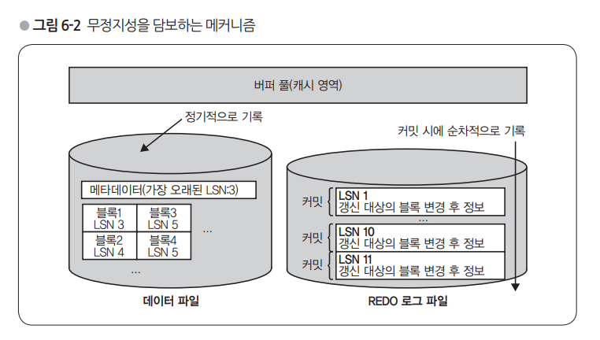
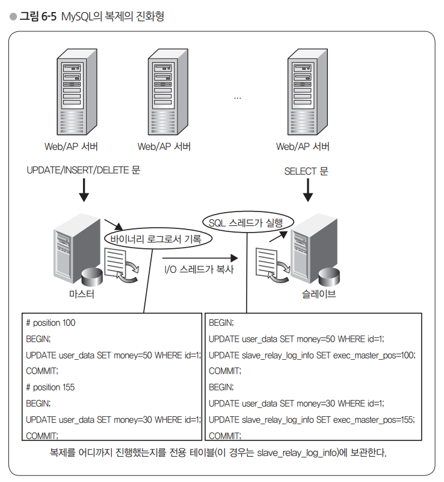

# 6장 트랜잭션과 무결성, 무정지성  

## 6.1 트랜잭션의 중요성 이해하기  

### 어중간한 상태 방지하기  

데이터베이스 서버에서 한 번의 처리는 INSERT나 UPDATE 같은 SQL문 단위를 말한다. 하지만 로직 상 여러 SQL 문을 조합해야 처리가 끝나는 경우가 대부분이다. 이 작업들이 순차적으로 문제 없이 실행되면 상관이 없으나, 실패했을 경우에 여러 문제가 생기게 된다. 특히, 작업 도중에 실패했을 경우에는 나머지 작업들이 실행되지 않으므로, 이전에 실행되었던 작업들에 대해서 롤백이 필요하다. 만약에 처리의 일부만 성공하고, 나머진 실패했을 경우, 게임, 금융 거래 등에서 문제가 발생하게 된다.  
이런 경우를 방지하기 위해서 데이터베이스가 일관성 있는 상태로 실패한 작업을 복구해주는 기능이 있고, 이를 실현해 주는 구조가 **트랜잭션**이다. 마지막까지 처리를 마치고 결과를 확정하는 것을 **커밋**, 커밋하지 않고 모든 작업을 되돌리는 것을 **롤백** 이라고 한다. SQL 문은 다음과 같다.  

``` SQL  
BEGIN
UPDATE ...
UPDATE ...
COMMIT / ROLLBACK  
```  

COMMIT 대신에 ROLLBACK을 하거나, COMMIT 하기 전에 데이터베이스와 접속을 끊으면 BEGIN 이후의 갱신 처리는 모두 사라진다. 웹 어플리케이션에서는 기본적으로 한 번의 HTTP 요청의 처리에 대해 하나의 트랜잭션을 수행하게 된다. 현대적인 프로그래밍 언어에서는 예외 처리 매커니즘을 갖고 있기 때문에 트랜잭션이 끝나기 전에 예외에 발생하면 그것을 캐치하여 ROLLBACK 한다고 기술한다. ?  

### SQL문 레벨에서의 롤백  

**단 한 번의 UPDATE 문을 실행한다면 트랜잭션은 불필요하다.** 라고 생각할 수도 있다. 하지만 한 번의 업데이트에서도 내부적으로 많은 일이 일어난다.  

- 여러 레코드를 업데이트 할 수 있다. 트랜잭션 기능이 없는 DB에서 여러 레코드를 업데이트 하는 도중 DB가 꺼지게 된다면 중간까지만 UPDATE 가 될 수 있다.
- 한 개의 레코드를 업데이트 하는 경우라도, 실제로 write를 하는 곳은 여러 곳이 될 수 있다. (레코드, 인덱스1, 인덱스2, ...)
- 인덱스가 없는 경우더라도 여러 열로 되어 있고 각각의 물리적 저장 위치가 다르다면 역시 여러 차례의 갱신이 실행된다

### 무정지성(fault tolerant) 확보하기  

무정지성 : 장애 직전까지의 커밋 결과를 손실하지 않고 마치는 것  

> 결함 감내 시스템(Fault tolerant system)은 시스템을 구성하는 부품의 일부에서 결함(fault) 또는 고장(failure)이 발생하여도 정상적 혹은 부분적으로 기능을 수행할 수 있는 시스템이다. (출처 : 위키백과)  

Oracle 이나 InnoDB 같은 트랜잭션을 지원하는 데이터베이스의 경우, redo 로그를 이용한 아키텍처로 무정지성을 보장한다.  

  

#### REDO 로그의 역할  

InnoDB에서는 트랜잭션을 커밋하면 그때마다 LSN(Log Sequence Number)이라는 시퀀스 번호가 증가하고, 그 번호와 갱신 대상의 블록 정보 (갱신할 곳의 블록 ID와 갱신할 곳의 위치 및 값)을 REDO 로그에 쓴다.  
열 값과 인덱스를 갖는 데이터 파일에는 커밋을 할 떄마다 기록을 하는게 아니라, 캐시 영역에 보관해주고 정기적으로 디스크에 기록하는 동작을 한다. 그래서 REDO 로그 파일이 최신 정보를 가지고 있고, 디스크의 데이터 파일은 오래된 정보를 갖고 있게 된다. 그래도 캐시 영역에 최신 데이터가 있기 때문에 어플리케이션에서 볼 떄는 최신 데이터를 읽을 수 있어서 문제가 되지 않는다.  
서버 장애로 DB 재기동을 하게 되면 캐시는 소실된다. 그러면 디스크의 데이터 파일과 REDO 로그를 조합해서 장애 발생 전 최신 상태로 복구해야 한다. 데이터 파일이 상대적으로 이전 데이터기 떄문에 최신 데이터를 기록하기 전에 REDO 로그의 LSN과 일치시키는 작업을 수행한다. 이를 충돌 복구(Clash Recovery) 라고 한다.  

#### 이중 기록의 비용  

데이터 파일과 REDO 로그 두 종류의 파일을 갖는 방식은 트랜잭션을 지원하는 DB에서 일반적으로 채택하는 아키텍처이다. 2번의 기록을 하기 때문에 기록량이 2배가 되면 성능상 이슈가 있지 않을까 생각할 수 있다.  
REDO 로그는 sequential write를 하기 때문에 random write를 하는 레코드나 인덱스에 비해서 훨씬 성능이 좋다. 그래서 REDO 로그 파일로 기록하더라도 추가 비용이 큰 문제가 되지 않는다.  

단, SSD 에 의한 고속화가 진행되면 REDO 로그 비용을 점차 무시할 수 없게 된다.  

## 6.2 잠금 매커니즘에 의한 배타 제어  

배타 제어를 하지 않으면 race condition 처럼, 처리에 대해 일관성 있는 결과를 보장할 수 없게 된다. 배타 제어를 위해 필요한 매커니즘이 바로 락(Lock)이다. 먼저 갱신할 클라이언트가 잠금을 확보하고, 다른 트랜잭션에서 동일한 레코드에 갱신을 하려고 하면 막는 동작을 한다.  

### 잠금의 범위  

MyISAM의 경우은 테이블, Oracle 이나 InnoDB는 레코드 단위 잠금이다. 테이블에서 lock을 걸어버리면 관계 없는 레코드에 대해서도 update 가 블록이 되어서 병렬성이 크게 저하된다.  

### 잠금 기간  

Lock은 트랜잭션의 종료(커밋 또는 롤백) 까지 유지된다. 만약, 커밋 전에 lock을 해제하고 나서 다른 사용자로부터 update 실행되면 롤백을 할 수 없게 된다.  
lock의 단점은 동일한 레코드에 대한 update를 동시에 한 클라이언트에서만 가능하다는 점이다. 그래서 여러 클라이언트에서 갱신할 수 있도록 잠금을 걸지 않고 배타 제어를 실시하는 lock free 라는 알고리즘도 있다.  

[Lock free](https://effectivesquid.tistory.com/entry/Lock-Free-%EC%95%8C%EA%B3%A0%EB%A6%AC%EC%A6%98Non-Blocking-%EC%95%8C%EA%B3%A0%EB%A6%AC%EC%A6%98)  

## 6.3 복제 및 트랜잭션  

### 원자성을 갖는 복제의 중요성  

복제 구성에 있어서 슬레이브는 '마스터에서 전송되어 온 업데이트성 쿼리를 실행하는 역할'을 한다. 업데이트성 쿼리를 실행하는 것만으로는 부족하고, '슬레이브는 마스터에서 보낸 업데이트성 쿼리 중에서 어디까지 실행했는지' 라는 정보도 관리해야 한다. 그렇지 않으면 슬레이브가 도중에 멈췄을 경우 어디서부터 마스터와 싱크를 맞춰나갈 지 알 수 없기 때문이다. 그래서 이 정보들은 원자성 있게 동일 트랜잭션에서 갱신해야한다.  

아래 그림을 보면 슬레이브는 바이너리 로그를 실행해 나가면서, '현재 어디까지 실행했는지' 를 관리하기 위해 실행을 마친 바이너리 로그의 위치 정보를 함께 저장하여 관리한다. 그리고 업데이트 SQL 문의 실행과 바이너리 로그의 위치 정보 갱신을 동일 트랜잭션에서 수행한다. 그래서 슬레이브가 죽더라도 재기동하면 마지막으로 바이너리 로그의 위치 정보를 찾아 그 다음부터 싱크를 맞춰나갈 수 있다.  

그리고 '데이터 update'와 '복제 상태 관리(바이너리 로그 위치 정보 갱신)' 는 원자성 있게 한 트랜잭션으로 묶여서 처리해야 한다. 그렇지 않으면 슬레이브 재기동을 하면서 데이터 update를 2번 하는 등 싱크가 맞지 않을 수 있다.  

  

### 사용자는 원자성이 있는 복제에 어떻게 대처하고 있는가?  

슬레이브가 죽었을 때, 슬레이브를 그냥 재가동 시키는 것이 능사가 아니다. 만약에 슬레이브의 복구 방법이 처음부터 재구축하는 방식으로 이루어진다면, 데이터 양에 따라서 부담스러운 워크로드가 될 수 있기 때문이다. 그렇기 때문에 현재 슬레이브가 위에서 설명한 것처럼 원자성을 갖춰서 차등 복제가 되고 있었다면, 바로 차등 복구가 가능할 것이다. 그렇지 않다면 전체 데이터를 복구하거나, 원자성이 맞지 않아서 복구 과정에서 일관성이 깨질 수도 있으니 주의해야 한다.  

그리고 데이터 불일치를 감지하는 방법은 테이블 일부 또는 전체를 스캔하여 체크섬 계산하는 형태로 이루어진다.
