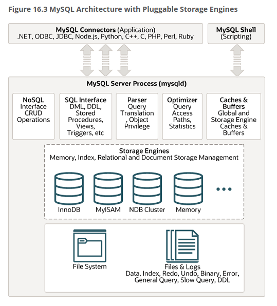

# 9장 MySQL로 배우는 데이터베이스 관리  

## 9.1 MySQL 도입의 포인트  

다음과 같은 부분들을 확인해야한다.  

- 정말 제대로 동작하고 있는지 확인
- 여러 매개 변수의 적절한 설정 방법
- 어떤 로그 파일이 있는지
- 버전 선택 기준
- 백업하는 방법
- 복제 설정 방법

### MySQL 설치 및 기본 설정  

순서  

1. 전용 사용자 만들기
    - mysql 이라는 사용자 및 그룹을 만드는 것이 일반적
2. 데이터 디렉터리 결정
    - 데이터베이스의 실제 데이터가 저장되는 곳을 지정해야 한다.
    - 일반적으로 `/var/lib/mysql` 에 저장한다.
    - 이 폴더는 mysql 사용자가 읽고 쓸 수 있도록 지정
    - apt 로 설치하면 자동으로 저 경로로 잡힘
    - apt로 설치하면 자동으로 `mysql_install_db(설치)` 와 `mysqld_safe(실행)` 을 해준다.
    - 거기에 리눅스 서비스로도 등록해주니 편리함
3. mysql 데이터베이스 작성
    - 데이터 디렉터리 설정 후, 사용자 인증 및 권한 정보, 저장 프로시저 등을 설정해야 한다.
    - 이런 관리용 메타 데이터를 담고 있는 데이터베이스가 필요한데 그게 `mysql` 데이터베이스이다.
    - 책에는 `mysql_install_db` 스크립트가 각종 초기 설정을 해준다고 나와있지만, 5.7 버전부터 deprecated 되었고, `/usr/bin/mysqld_multi` 스크립트를 보면 초기화 관련 설정이 있다. (유저, 데이터 위치 등)
4. 설정 파일 만들기
    - `/etc/mysql/mysql.conf.d/mysqld.cnf` 에서 설정을 한다.
    - 책에 나온 my.cnf 파일은 `/etc/my.cnf`에 있으며, 위에 파일을 참조하는 역할만 한다.
5. MySQL 시작/접속/정지
    - `/etc/init.d/mysql` 파일을 참조하면 start, stop 모두 있다.
    - start : `su - mysql -s /bin/sh -c "/usr/bin/mysqld_safe > /dev/null 2>&1 &"`
    - stop : `shutdown_out= $MYADMIN shutdown 2>&1`
    - 서비스 파일을 참조하면 `ExecStart=/usr/sbin/mysqld --daemonize --pid-file=/run/mysqld/mysqld.pid` 이다.

### 스토리지 엔진  

mysql 클라이언트로 mysql 서버 프로세스(mysqld) 에 접속하여 SQL 문을 날리는 경우, 다음과 같은 과정 아래서 실행된다.  

1. 클라이언트의 접속을 하용하여 전용 스레드를 할당. 접속이 끊긴 상태에서는 스레드가 다음 접속에 대비해 캐시 영역(커넥션 풀)에 보관된다. 이로써 접속/해제의 오버헤드를 줄인다.
2. 이전에 받은 것과 동일한 select문을 받으면, 캐시해둔 정보가 있는지 확인 후 반환 (쿼리 캐시)
3. 쿼리 캐시에 히트하지 않으면 SQL 문의 문법이 올바른지 체크 (구문 분석 처리)
4. 구문 분석이 완료되면 SQL 문의 실행 계획을 결정한다. 실행 계획은 테이블에 액세스하는 방법을 결정하는데, 구체적으로는 인덱스 사용 여부다. 이를 사용하는 경우 어떤 인덱스를 사용할지와, 조인 시에 어떤 테이블을 먼저 읽어야 할지를 결정한다. (최적화)

쿼리 캐시, 구문 분석 및 실행 계획을 만드는 방법은 여타 RDBMS도 비슷하다. 차이가 나는 부분은 레코드의 보관 방법이다. 로컬 파일로 관리할 수도 있고, 메모리에 모두 들고 있을 수도 있다. 또는, 원격 서버 상에 파일로 저장하는 구현도 있을 수 있다. (NFS 같은건가). 또한 파일로 관리하는 경우에도 파일을 바이너리 형식으로 할 지, CSV로 할 지와 같은 포맷 차이도 있다. 같은 바이너리 형식이라도 레코드 길이를 보관하는 장소 및 인덱스 구성에 따라 구현 방식은 달라진다.  

포맷뿐 아니라 저장 및 검색의 타이밍도 구현에 따라서 다르다. SQL문 실행 종료 시 업데이트 결과를 디스크에 동기적으로 기록하는 구현도 있지만, 빠른 처리 속도를 위해 동기적인 기록을 하지 않는 경우도 있다. 어떤 구현이 우수한지는 용도에 따라서 달라진다. 데이터가 중요하면 동기적으로 저장하는 방식이 더 선호될 것이고, 속도가 중요한 경우는 모아서 기록하는 방식이 더 좋을 것이다.  

MySQL에서는 다양한 레코드 처리 구현 방법을 제공하고 있으므로, 용도에 맞는 것을 선택할 수 있는 아키텍처를 채용하고 있다. **스토리지 엔진의 선택의 테이블 단위로 할 수 있다.** 따라서 어플리케이션에서 여러 스토리지 엔진을 혼합할 수 있다.

  

#### InnoDB 스토리지 엔진  

MySQL 스토리지 엔진 중 가장 널리 사용되고 있다. MyISAM 과의 가장 큰 차이는 트랜잭션 지원 유무이다. 트랜잭션이 필요한 일반적인 OLTP 계에서는 InnoDB를 쓰고, MyISAM은 데이터 웨어하우스 등의 용도에 사용한다고 한다.  

InnoDB는 트랜잭션을 지원하기 때문에 ACID를 보장하여 압도적으로 많이 쓰이는 것 같다.  

- Atomicity(원자성) : 복수의 SQL문을 모아서 하나의처리 단위로 할 수 있다. 모두 커밋되거나 롤백된다.
- Consistency(일관성) : 여러 테이블에 걸쳐 있는 갱신 등은 도중에 오류가 발생하더라도 다른 한쪽만이 갱신되어 버리는 모순된 상태가 되지 않는다.
- Isolation(독립성) : 참조/갱신이 충돌하는 경우에도 일관성이 없는 상태가 되지 않도록 배타 제어가 가능하다.
- Durability(내구성) : 커밋 결과는 확실하게 저장되어 전원 차단이 발생해도 복구가 가능하다.  

#### 파일 구성  

MySQL에서는 스토리지 엔진에 관계없이 모든 테이블에 대해 테이블 정의 정보를 기록한 `테이블명.frm` 이라는 파일이 만들어진다. MySQL 5.0 버전까지는 ASCII 문자로 구성되었지만 5.1 버전 부터는 Unicode를 지원해 한국어 이름의 테이블 명도 다룰 수 있게 되었다.  

## 9.2 MySQL 운용에 필요한 파일의 기초 지식  

### 로그 파일 형식  

MySQL의 로그는 본체 프로세스의 상태를 확인하거나 느린 쿼리를 확인하는 경우에 중요한 역할을 한다.  

#### 오류 로그 파일  

본체 프로세스의 기동/정지 정보 및 오류 정보를 출력한다. 비정상 종료가 된 경우 스택 로그를 오류 로그 파일에 덤프하고 정지한다.  

#### 슬로우 쿼리 로그 파일  

일정 시간 이상을 필요로 하는 쿼리를 로그 파일에 출력하는 기능이다. 시간이 초 단위로 걸린다는 것은 인덱스 전략이 적절하지 않은 등 문제가 있을 수 있다. 설정은 초 단위 뿐 아니라, 밀리초 단위로도 할 수 있다. 그리고 빠르지만 실행 빈도가 많은 무거운 쿼리를 밝혀내는 데도 사용할 수 있다.  

#### 일반 로그 파일  

`General Query Log`가 정식 명칭으로 실행된 모든 SQL 문을 로그 파일에 출력하기 위한 기능이다. ORM 등 프레임워크를 사용할 때 SQL 문이 자동 생성되는 경우가 많은데, 프레임워크 설정이 잘못되었을 경우 예상 외로 많은 쿼리가 들어올 수 있다. 그 동작을 구분하는데 유용하게 사용한다.  

#### 바이너리 로그 파일  

이 파일엔 APP에서 실행한 업데이트 성의 SQL이 모두 기록된다. 이 로그 파일을 통해서 replication의 sync를 맞추거나, 복구를 하는데 사용한다.  

### my.cnf의 설정 항목  

InnoDB 기준으로 설명한다.  

#### baseDir/dataDir  

baseDir은 MySQL을 설치한 디렉토리이다. dataDir은 데이터베이스의 데이터를 보관하고 있는 디렉토리이다. 데이터 디렉토리는 사용 경과에 따라서 늘어나기 때문에 별도의 파일 시스템에 배치하는 경우가 많다.  

#### port/socket  

port는 MySQL 서버가 접속을 대기하는 포트 번호이다. socket은 UNIX 소켓 파일에 따른 접속을 위한 파일명을 지정한다. 로컬 접속은 TCP/IP 대신에 소켓 파일을 사용할 수 있다.  

#### default-storage-engine  

테이블을 만들때 기본으로 선택되는 스토리지 엔진을 설정한다. 기본값 이외의 테이블을 설정하려면 CREATE TABLE 문 마지막에 `ENGINE=MEMORY`와 같이 지정하면 된다.  

#### log-bin  

바이너리 로깅을 활성화하기 위한 파라미터이다.  

#### slow-query-log  

슬로우 쿼리 로깅을 활성화하기 위한 파라미터이다.  

#### long-query-time  

슬로우 쿼리 로그에 남는 쿼리의 기준 시간을 설정한다.  

#### max_connections  

MySQL에 접속 가능한 상한 접속 수를 지정한다.

#### innodb_buffer_pool_size  

InnoDB 데이터 영역을 메모리 상에서 관리하기위한 버퍼 사이즈를 의미한다. 한 서버에서 MySQL 프로세스 하나만을 띄워놓고 사용하는 경우, 실제 메모리 크기의 60~80% 정도로 설정한다.

#### innodb_flush_method  

InnoDB 데이터 파일과 InnoDB 로그 파일을 쓰고 읽는 방법을 지정한다. `innodb_flush_method=O_DIRECT`를 지정하면 OS의 다이렉트 I/O 기능이 활성화된다.  

#### innodb_data_file_path  

InnoDB 데이터 파일의 초기 크기와 배치 디렉터리를 지정하는 파라미터이다. 미리 많은 공간을 할당해두거나, 자동으로 확장시킬 수 있는 기능이 있다.  

#### innodb_autoextend_increment  

`innodb_data_file_path` 에 autoextend를 지정하면 데이터 크기가 꽉 찼을 경우에 자동으로 확장하는데, 그 확장시키는 단위를 조정하는 파라미터이다. 데이터가 차오르는 속도가 확장 속도보다 빠를 경우에는 이 파라미터를 상향하면 된다.  

#### innodb_log_file_size  

InnoDB 로그 파일의 크기를 지정한다. InnoDB 로그 파일은 REDO 로그라고도 불리며, 갑자기 크래쉬가 발생했을 경우에 제대로 복구할 수 있도록 하는 중요한 역할을 한다.  
REDO 로그 파일의 크기가 작으면 복구 속도가 빨라지지만, 체크 포인트 라는 동기식 기록 작업이 빈번하게 발생하게 되어 update 성능이 저하된다. 반대로 큰 경우에는 체크 포인트 빈도가 줄어들기 때문에 성능 저하가 덜하나, 크래쉬가 발생했을 때 복구에 보다 많은 시간이 걸리게 된다. 이 트레이드 오프를 고려하여 크기를 결정해야 한다.  

## 9.3 MySQL 백업의 기초  

### 무엇을 위해 무엇을 백업할 것인가?  

백업의 목적은 디스크 오류 또는 작동 오류로 데이터가 손상되었을 때 원래대로 복구하기 위함이다. 그러면 무엇을 백업할 것인가?  
    
1. 데이터베이스 파일
2. 오류 로그 파일, 슬로우 쿼리 로그 파일
3. 바이너리 로그 파일
4. 설정 파일 my.cnf
5. 실행 파일
6. 기타 공유 라이브러리, 지원 스크립트, 테스트 툴 등  

1에는 테이블 정의 정보와 내용 등 테이블 자체와 뷰, stored procedure 등이 저장된다. 주요 백업 대상은 1이다.  
2는 필수는 아니지만 문제 해결 등을 위해 백업하는 경우가 많다. 그리고 기본적으로 1와 함께 저장되고 있다.
4도 2와 같은 이유로 백업하는 경우가 많다.
5,6은 언제든지 다시 설치할 수 있으므로 백업할 필요가 없다.  

### 백업 유형  

#### 콜드 백업과 온라인 백업  

MySQL의 실행을 멈추고 백업하는 것을 콜드 백업, 정지 없이 실행하는 것을 온라인 백업이라고 한다. 주간에만 동작하는 DB라면 야간에 스크립트를 써서 콜드 백업을 하면 된다.  
온라인 백업은 백업 도중에 들어오는 update를 처리하는 것이 중요하다. 백업은 나중에 복구할 목적으로 만드는 것이기 때문에 **특정 시간대에 대한 데이터가 일관성** 있는 상태로 존재해야 한다. 그래서 데이터 파일을 단순히 cp하는 것으로는 부족하다.  

#### 논리적 백업과 물리적 백업  

논리적 백업은 SQL 문과 같이 인간이 읽을 수 있는 형식으로 백업하는 것이다. mysqldump라는 툴에 의해서 논리적 백업이 가능하며, 바이너리 형식으로 그대로 백업한다.  
물리적 백업 및 논리적 백업의 큰 차이는 복원 방법이다. 물리적 백업은 파일 복사만으로 복원할 수 있지만, 논리적 백업은 백업 파일에 쓴 SQL 문을 직접 실행하여 복원하게 된다.  
논리적 백업과 물리적 백업은 트레이드 오프 관계가 있다. 논리적 백업은 내용을 읽고 이해할 수 있으며 수정도 가능하다. 그래서 MyISAM 스토리지 엔진의 테이블을 mysqldump로 백업하고 테이블 정의 정보만 InnoDB로 수정하여 복원하면 InnoDB로 변환도 가능하다.  
하지만 논리적 백업은 복원 시간이 매우 길어진다는 단점이 있다. 물리적 백업은 파일 복사에만 시간이 소요되는데 반해, 논리적 백업은 빈 테이블을 만들고 SQL문을 수행하기 때문이다. 그 동안 인덱스 재생성 등 기타 처리도 같이 발생하게 된다.  
대신 물리적 백업은 데이터 파일 자체를 덤프하기 때문에 만약에 같은 기기에서 백업을 실행할 경우 현재 스토리지 용량이 절반 이하를 차지하고 있어야 수행이 가능하다. 그에 반해 논리적 백업은 텍스트로 백업을 하기 때문에 압축 효율이 높아서 원래 크기의 1/20 정도로 압축이 가능하다.  
데이터 크기가 충분히 작은 경우엔 물리적/논리적 모두 상관 없다. 하지만 오래 걸리는걸 고려하면 물리적 백업을 선택하겠지.  
MySQL에서 온라인으로 물리적 백업을 하려면 LVM(Logical Volumn Manager) 및 일부 스토리지 제품이 지닌 스냅샷 기능 또는 외부 도구 xtra-backup을 사용하길 권한다고 한다.  

### 복구 방법  

백업을 한 시점 까지만 데이터를 복원할 수 있다. 백업 이후에 많은 시간이 흐른 뒤에 장애가 난 경우에 백업 이후 갱신 정보는 손실될 수 있다. 이를 위해 바이너리 로그가 있으며, 백업 이후 발생한 갱신 정보는 바이너리 로그에서 찾아 읽어서 복수를 할 수 있다. 이렇게 바이너리 로그를 이용하여 복구하는 것을 포인트 인 타임 리커버리(PITR) 또는 롤 포워드 리커버리라고 말한다.  

## 9.4 MySQL에서의 백업/복구  

### 콜드 백업의 절차  

콜드 백업은 MySQL 기동을 멈춘 후, 데이터 파일을 복사하기만 하면 된다. 압축할지 여부는 각자의 판단.  

### 바이너리 로그에 의한 포인트 인 타임 복구  

백업 이후에 발생한 갱신에 대한 복구는 바이너리 로그를 이용한다.  

#### 바이너리 로그 활성화  

my.cnf 내에서 log-bin 이라고 한 줄을 추가해야 바이너리 로그 생성이 된다.  

#### 바이너리 로그에 의한 복구  

먼저 바이너리 로그를 SQL 문으로 변환하고 그것을 실행하는 접근 방식을 취한다. `mysqlbinlog` 명령어를 사용하면 된다.  

`mysqlbinlog` 명령어를 이용해서 표준 출력으로 SQL 문으로 뽑은 다음에, mysql 명령어를 실행할 때 표준 입력으로 넣어주면 SQL 문이 실행된다.  
`mysqlbinlog` 명령어는 끝에 ROLLBACK 명령어를 포함하기 때문에 한 트랜잭션이 여러 바이너리 로그 파일에 걸쳐서 있다면 트랜잭션이 깨지게 되므로 주의가 필요하다.  

#### 바이너리 로그의 포맷  

SQL 문의 내용이 그대로 기록되는 **문장 기반**과 각 레코드의 갱신 전과 후의 바이너리 이미지가 기록되는 **행 기반** 두 종류가 있다.  

#### 바이너리 로그 배치 장소  

바이너리 로그를 잃어버리면, 백업 이후 발생한 update에 대해서 복구를 할 수 없게 되므로 보관에 주의가 필요하다. RAID 상에 둬서 디스크가 망가져도 손실되지 않도록 하는 중복화를 권장  

### mysqldump에 의한 온라인 백업  

테이블 데이터의 내용을 SQL 문으로 덤프할 수 있다. 백업 시 각종 옵션을 줄 수 있다.  

- `-u` : 사용자 지정
- `--lock-all-tables` : 백업 중 전체 테이블에 shared lock을 걸어 갱신을 막는다.
- `--master-data=2` : 백업 시점의 바이너리 로그의 위치 정보를 덤프 파일에 기록하는 것이다. 복원 이후에 바이너리 로그를 어디서부터 참조해야 할 지 기록하는 것이다. 백업 파일의 선두에 바이너리 로그의 위치 정보가 기록된다.  

기본적으로 mysqldump에 의한 백업 파일의 문자 인코딩은 UTF-8이다. 만약에 OS의 기본 인코딩이 다르게 설정되어 있다면 인코딩 변환을 수행하고 백업하게 되어있다. 이 경우 CPU 연산이 필요하므로, OS의 기본 인코딩 그대로 저장할 수 있는 옵션도 있다.  

#### 잠금을 걸지 않는 백업  

앞에서 소개한 백업 방법은 전체 테이블에 lock을 걸기 때문에 백업 시간 동안 update가 막히게 된다. InnoDB는 lock을 걸지 않은 채로 백업하는 기능을 제공하고 있다. InnoDB에는 스냅샷을 뜨는 기능이 있다. 스냅샷은 select를 받으면 스냅샷을 만든 당시의 내용을 돌려주는데, 이를 이용한 백업을 하게 된다. 요약하면 스냅샷을 뜨는 전후로만 lock을 거는 것이다.  

1. 백업 시작 직후에 전체를 lock
2. 스냅샷 취득
3. 바이너리 로그 위치 정보를 기록
4. lock 해제
5. 각 테이블 내용을 select하면 결과는 스냅샷 취득 시점의 결과를 반환한다.  

옵션  

- `single-transaction`
- `--master-data=2`

스냅샷을 취득하고 바이너리 로그 위치 정보를 기록하는 일은 대부분 밀리초 수준에서 끝나게 된다. 하지만 내부적으로 `FLUSH TABLES WITH READ LOCK` 쿼리는 기존에 lock이 잡혀있지 않던 테이블을 lock을 잡는데, 장기간 실행하고 있는 쿼리가 있으면 그게 끝날때까지 계속 기다리게 된다. 그러면 다른 세션은 업데이트를 할 수 없게 되므로, 잠금 시간을 최소화 하자는 이 방법의 목적에 맞지 않게 된다. 그러니까 장기간 동안 실행되고 있는 쿼리가 있는지 확인해야 한다.  
복제 구성이 되어있는 경우, 마스터보단 슬레이브에서 백업을 하고 싶을텐데, 슬레이브의 백업 정보와 마스터의 바이너리 로그 간 일관성이 있어야한다. 다시 말하면, 슬레이브에서 백업을 복원한 이후, 마스터의 바이너리 로그의 어느 부분부터 복원을 할 지 기록할 필요가 있다. 이 또한 `--dump-slave` 옵션을 주면 된다.  

#### 바이너리 로그 삭제  

백업 기간과 겹치는 바이너리 로그는 필요가 없기 때문에 직접 rm 명령으로 지우거나 `PURGE MASTER LOGS TO` 명령으로 삭제 가능하다. 42번을 지정해서 지우면 '41번까지는 필요가 없으므로 삭제해도 된다.' 라는 의미로 41번까지 삭제된다.  

### LVM 스냅샷 기능을 통해 온라인 백업  

Linux 등이 갖고있는 LVM(Logical Volumn Manager) 는 스냅샷 취득 기능이 있어서, 그 시점에서 디스크에 쓰여져 있는 데이터의 스냅샷을 기록할 수 있다.  
스냅샷 동안만 lock을 거는 방법은 같고, 스냅샷의 방법을 LVM을 통해 하는 것이다. 스냅샷을 만든 뒤 그 내용을 디스크에 저장한다. 그리고 복원 절차는 콜드 백업처럼 저장한 백업 데이터를 mysql 데이터 디렉토리에 복사하여 복원하면 된다. 그리고 스냅샷 뜨기 전에 바이너리 로그 위치도 기록해놨다가, 복원할 때 쓰면 된다.  
주의할 점은 LVM 스냅샷이든 스토리지 기능을 이용하든 대부분의 경우 디스크에 아직 기록되지 않은 데이터(파일 시스템 캐시에만 존재)는 스냅샷에 포함되지 않기 때문에 백업되지 않는다. InnoDB는 기본 설정으로 커밋 시에 디스크에 동기적으로 write하지만, MyISAM은 그렇지 않다. 그래서 OS의 sync 커맨드 등으로 강제로 디스크에 기록하게 한 다음에 스냅샷을 취하는 편이 안전하다.