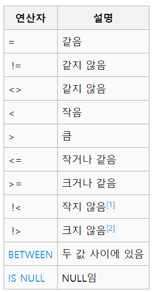
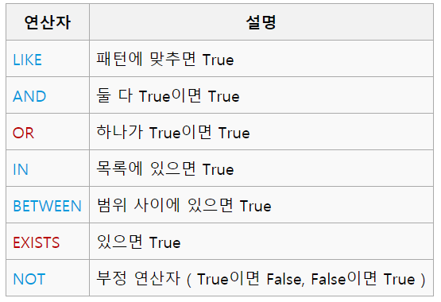

# 간단한 SQL  

### 연산자  


### 논리 연산자  


### LIKE
```
select * from table where TEXT LIKE '%SQL%';
```
% : 공백 또는 여러자
_ : 한글자
\\% 이스케이프 처리 필요

### IN
```
SELECT * FROM 테이블명
WHERE 컬럼명 IN (값1, 값2, ...);
```
### BETWEEN
```
SELECT * FROM Products
WHERE Price BETWEEN 10 AND 20;
```

### 테이블 만들기  
```
create table 이름(
id int NOT NULL,
name varchar(20),
a int,
b int);
```  

### 테이블 삭제  
```
drop table name;
delete from table(내용만 삭제)
```

### 삽입  
```
insert into Table(a,b,c,d) values(1,2,3,4);
```

### 삭제  
```
delete from table where a=1;
```

### 갱신  
```
update table set a=1, b=1 where c=1;
```

### 검색
```
select a(*) from table where a = 1 order by asc/desc;
```

### count, sum, avg, min, max  
```
select count(* or 컬럼) from table where a = 1;
```

### group  
```
select number, count(*) from table group by number;
```
여기에 또 조건 적용하려면,  
```
select number, count(*) from table group by number having count(*) > 4;
```

### 서브쿼리  
```
select name, money from emp where money > (select money from emp where name = '???');
```
