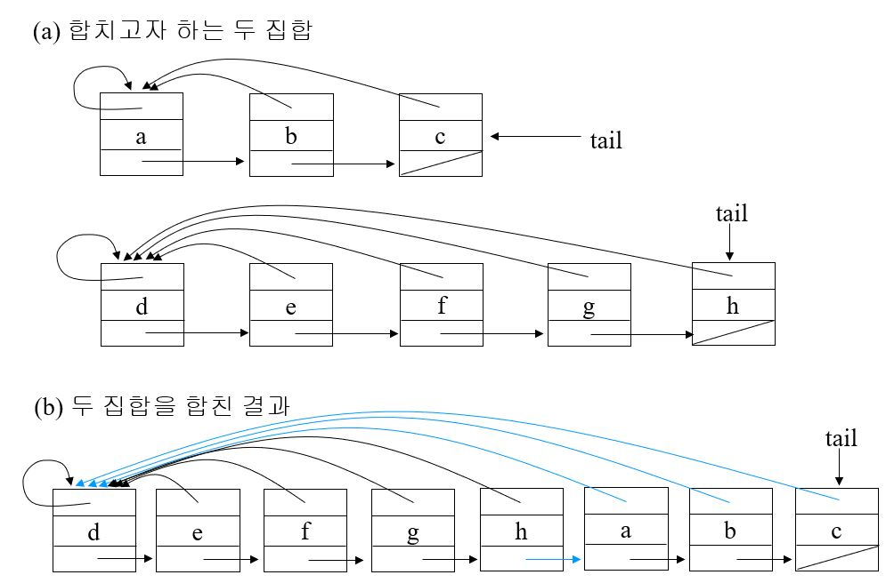
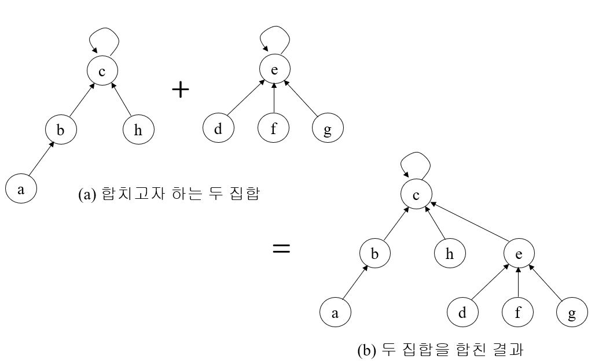

# 상호배타적 집합(Disjoint Set, Union Find Tree)  

1. 상호 배타적 집합
  - 지원할 연산
    1. Make-Set(x) : 원소 x로만 이루어진 집합을 만든다.
    1. Find-Set(x) : 원소 x를 가지고 있는 집합을 알아낸다.
    1. Union(x,y) : 원소 x와 y를 가진 집합들의 합집합
2. 연결리스트로 상호배타적 집합 구현하기
  - 개념  
    - 같은 집합의 원소들은 하나의 연결리스트로 관리한다.
    - 연결 리스트 맨 앞의 원소를 집합의 대표 원소로 삼는다.
    
    - 무게를 고려하면 두 집합중 크기가 작은 것을 뒤에 붙이면서 합친다.
    - 왜냐하면 대표 원소를 가리키는 포인터 갱신 작업을 최소화하려는 의도

3. 트리로 상호배타적 집합 구현하기
  - 개념
    - 같은 집합의 원소들은 하나의 트리로 관리한다.
    - 자식이 부모노드를 가리킨다.
    - 트리의 루트를 집합의 대표 원소로 삼는다.
      

```
// disjoint-set 초기화 코드
int[] p = new int[numOfCity + 1];
			
for (int i = 1; i <= numOfCity; i++) {
  p[i] = i;
}
			
int[] rank = new int[numOfCity + 1];

if (findSet(p, item.from) != findSet(p, item.to)) {
  union(p, rank, item.from, item.to);
  count++;
  result += item.d;
}
      
private static int findSet(int[] p, int x) {
  if (x != p[x]) {
    p[x] = findSet(p, p[x]);
  }
    return p[x];
}

private static void link(int[] p, int[] rank, int x, int y) {
  if (rank[x] > rank[y]) {
    p[y] = x;
  } else {
    p[x] = y;
    if (rank[x] == rank[y]) {
      rank[y]++;
    }
  }
}

private static void union(int[] p, int[] rank, int x, int y) {
  link(p, rank, findSet(p, x), findSet(p, y));
}

     
