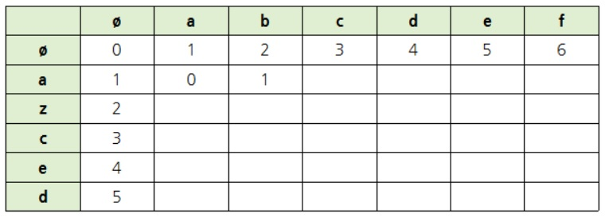
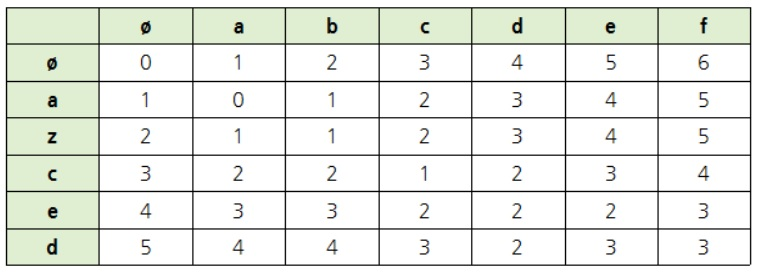
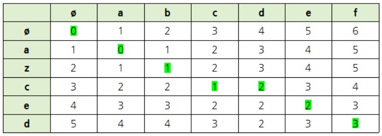

# 편집거리 알고리즘  

**최소 편집거리(Mininum Edit Distance) 알고리즘** 이란 두 개의 문자열이 같아지기 위해서 최소 몇 번의 **추가(Add)**, **삭제(Delete)**, **편집(Edit)** 과정을 거쳐야하는지 구하는 알고리즘이다.  

먼저, abcdef와 azced라는 문자열을 비교한다고 가정하면,  
1. b를 z로 바꾸고(edit)
2. d를 삭제하고(delete)  
3. f를 d로 바꾼다.(edit)

이 과정을 두 문자열을 이용한 행렬로 나타내면 다음과 같다.  

  

위 숫자들이 의미하는 것은 두 알파벳 간의 거리다.  

두 문자가 같으면 왼쪽 위의 숫자를 그대로 가져온다.

두 문자가 서로 다르다면 **왼쪽**, **왼쪽 위**, **위쪽** 3가지 중 최솟값에 1을 더한다.  
1. 왼쪽에 1을 더한다 : 단어 추가  
2. 왼쪽 위에 1을 더한다. : 단어 편집
3. 위쪽에 1을 더한다. : 단어 삭제

이를 계속 진행하면 다음과 같은 행렬이 나온다.
  

결과적으로 가장 오른쪽 하단에 있는 숫자가 최소 편집 거리가 된다.  

반대로 편집 과정을 추적하려면 가장 오른쪽 밑에서부터 시작한다. 다음과 같은 알고리즘을 따른다.  

1. **왼쪽**, **왼쪽 위** , **위쪽** 중에서 최솟값 s를 찾는다.
2. s가 왼쪽 위인 경우로 자신과 같으면 아무런 변화가 없는 것이다.  
3. s가 자신보다 작다면 그 위치를 찾는다.
  (3-1) s가 왼쪽인 경우 : 열에 해당하는 단어를 삭제한 경우
  (3-2) s가 왼쪽 위인 경우 : 열에 해당하는 단어를 행에 해당하는 단어로 수정한 경우
  (3-2) s가 위쪽인 경우 : 행에 해당하는 단어를 추가한 경우

  

출처 : http://blog.naver.com/PostView.nhn?blogId=ndb796&logNo=220870218783&parentCategoryNo=23&categoryNo=&viewDate=&isShowPopularPosts=true&from=search
