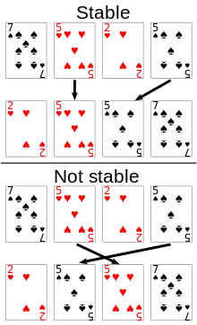

# 정렬  

## 목차  
* [안정 vs 불안정 정렬](#안정-vs-불안정-정렬)
* [삽입 정렬](#삽입-정렬)
* [기수 정렬](#기수-정렬)
* [퀵 정렬](#퀵-정렬)  

## 안정 vs 불안정 정렬  
- 안정 정렬 : 동일한 값에 대해 기존의 순서가 유지되는 정렬 방식

- 불안정 정렬 : 동일한 값에 대해 기존의 순서가 뒤바뀔 수 있는 정렬 방식  

  

## 삽입 정렬
**안정 여부**  
- 안정  

**시간복잡도**
- 평균 : O(n^2)
- 최악 : O(n^2)
- 최선 : O(n)  

**공간복잡도**
- 추가 공간이 temp 하나만 필요하기 때문에 O(1)이다.  

**유용한 사용 예**
- 배열 크기가 작을 때 좋다.
- 배열을 입력받으면서 바로 정렬 가능하다.

**정렬 방법**  
- 정렬하려는 요소 n을 배열의 이미 정렬된 부분 중 어느 부분에 넣을지 찾아서 삽입하는 정렬이다.
- 배열의 첫 번째 요소는 이미 정렬이 되어있다고 가정하고 두 번째부터 시작한다.
  
  

## 기수 정렬  
**안정 여부**  
- 안정  

**시간복잡도**
- O(dn). (d는 가장 큰 데이터의 자릿수)
- 예를 들어 d가 10000이라면 시간 복잡도는 O(5n) = O(n)

**공간복잡도**
- O(n+r).
- 원소 n에 대하여 n개의 메모리 공간 사용
- 기수 r에 따라서 버킷 공간이 추가로 필요(10진수면 10개, 알파벳이면 26개)

**유용한 사용 예**
- 정수와 같은 자료는 정렬이 매우 빠르다.
- 하지만, 기수가 클 수록 공간이 많이 필요하고, 자릿수 d가 클 수록 효율적이지 않다.

**정렬 방법**  
- 마지막 자릿수부터 첫 자리까지 비교하면서 정렬한다.
- 예를 들면, 일의 자리수를 기준으로 해당하는 큐(버켓)에 넣었다 꺼내서 정렬한다. 이를 마지막 자리수까지 반복하면 정렬이 완료된다.
- 자리수가 모자란 경우엔 0번 버켓에 넣는다.

- LSD radix sorting이 작은 자리수에서 큰 자리수로 정렬한다.
- MSD radix sorting은 큰 자리수에서 작은 자리수로 정렬한다.

  

## 퀵 정렬  
**안정 여부**  
- 불안정  

**시간복잡도**
- 최악 : O(n^2)  
- 평균 : O(nlogn)  

**공간복잡도**
- O(logn)

**유용한 사용 예**
- 일반적으로 가장 좋은 정렬을 제공한다.

**최악의 경우**  
- 오름차순이나 내림차순으로 정렬되어 있을 때

**정렬 방법**  
  
  
  
