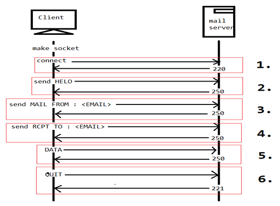
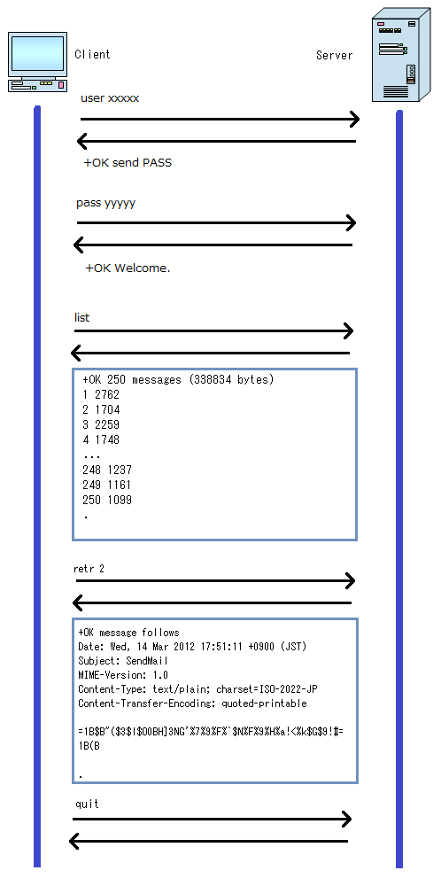
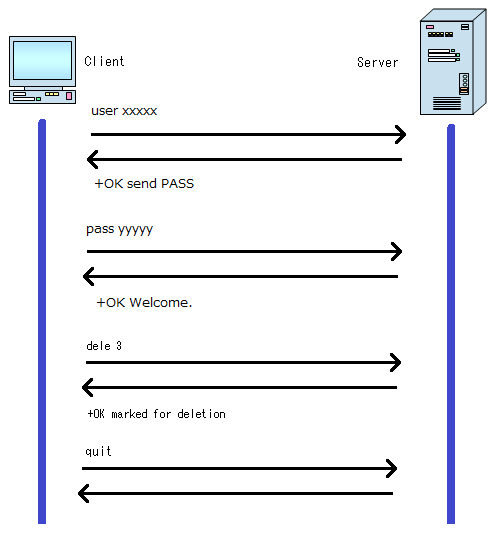

# TCP/IP가 보이는 그림책  

## 목차  
* [1장 TCP/IP](#1장-TCP/IP)
* [2장 통신 서비스와 프로토콜](#2장-통신-서비스와-프로토콜)
* [3장 애플리케이션층](#3장-애플리케이션층)
* [4장 트랜스포트층](#4장-트랜스포트층)
* [5장 네트워크층](#5장-네트워크층)
* [6장 데이터 링크층과 물리층](#6장-데이터-링크층과-물리층)
* [7장 라우팅](#7장-라우팅)

## 1장 TCP/IP  

##### TCP/IP
엄밀히는 TCP와 IP 프로토콜을 가리키는 말이지만, 일반적으로 인터넷에서 사용되는 통신 프로토콜군을 총칭하여 TCP/IP라고 한다.

TCP/IP의 특징중 하나는 '데이터를 일정한 크기로 분할해서 보낸다.' 라는 것이다. 작게 나눠진 데이터 하나를 패킷이라고 하며, 이런 통신 방법을 '패킷 통신' 이라고 한다.

##### 패킷  
데이터 전소잇에 데이터를 일정한 크기로 잘라서 보내는데, 이때 사용되는 정보의 전송 단위가 패킷이다. 한 패킷은 보통 1,024비트다. 각 패킷에는 데이터, 데이터 수신처, 주소, 제어 부호 등의 정보가 담겨있다.

##### 헤더와 트레일러  
송신측의 각 계층에서는 수신측의 동일한 계층에서 필요한 정보를 공통된 서식으로 데이터에 추가해 나간다. 이때 데이터보다 앞에 추가한 정보를 헤더, 뒤에 추가한 정보를 트레일러라고 한다.

##### TCP/IP 5 layers  
- 애플리케이션층
- 트랜스포트층
- 네트워크층
- 데이터 링크층
- 물리층

## 2장 통신 서비스와 프로토콜  

##### 전자 메일  
주로 전송을 담당하는 것이 SMTP(Simple Mail Transfer Protocol)이고, 수신을 담당하는 것이 POP(Post Office Protocol)이다.  
SMTP를 이용하여 메일을 전송하는 프로그램을 SMTP 서버, POP을 이용하여 클라이언트에게 메일 제공을 담당하는 프로그램을 POP 서버라고 한다. 일반적으로 한 대의 컴퓨터가 두 서버를 겸임하고 있다.

##### 파일 전송  
FTP(File Transfer Protocol)을 기초로 수행된다. 허가받은 클라이언트는 FTP 서버의 특정 전송 공간에 파일을 업/다운로드 할 수 있다.

##### 원격 로그인  
Telnet 프로토콜을 쓰지만, 보안상의 문제로 잘 쓰지 않는다. 보안 기능을 가지고 있는 원격 로그인용 프로토콜은 SSH(Secure SHell)이 있다.

## 3장 애플리케이션층  
'통신 서비스'를 실현하는 역할을 수행한다. HTTP, SMTP, POP, FTP 등이 있다.  

이 층은 '송신측과 수신측'이 아니라 '클라이언트와 서버'라는 개념을 갖고 있다.

애플리케이션에서 추가되는 헤더를 애플리케이션 헤더라고 한다. 여기서 서비스를 실현하기 위해 가장 중요한 '요청과 응답'에 대한 정보가 들어있다.(프로토콜에 따라서 헤더를 사용하지 않기도 한다.)  

클라이언트가 서버에 서비스를 요청할 때 구체적인 데이터를 주고받지 않고 어떤 연락만 취할 때는 데이터 부분이 빈 상태로 헤더만 보내기도 한다.  

##### HTTP 프로토콜  
'요청'과 '응답'이라는 두 종류의 패킷을 사용하여 텍스트 형식으로 주고받기를 수행한다.  
한 번 요청과 응답이 끝나면 통신은 완결되고, 과거에 수행한 통신과 관련을 맺게 되는 경우는 없다. 이렇게 한 번으로 끝나는 프로토콜을 무상태 프로토콜이라고 한다.  
하지만 무상태로는 완전히 처리할 수 없는 서비스가 있기 때문에 쿠키와 세션을 이용한다.  
쿠키는 HTTP 프로토콜의 정규 장치가 아니다. 쿠키는 보통은 CGI(Common Gateway Interface) 등 클라이언트로부터 요청에 맞게 웹 페이지를 작성하는 장치와 함께 사용한다.  

##### SMTP 프로토콜  
SMTP 프로토콜에서 명령은 '4문자 알파벳'으로, 응답은 '3자리 숫자'로 나타낸다.  
  

##### POP3 프로토콜  
메일 서버로부터 자기앞으로 온 메일을 받을 때 사용하는 것이 POP 프로토콜이다. 현재는 POP3(version3)가 주류를 이루고 있다.  
POP3 프로토콜에서는 명령은 원칙적으로 '4문자의 알파벳'으로, 응답은 '+OK' 또는 '-ERR'로 나타낸다.  
  
  

##### MINE  
전자메일의 헤더로 사용할 수 있는 문자 코드는 US-ASCII(숫자와 영문 반각문자) 뿐이다. 또한 전자메일의 데이터는 텍스트밖에 보낼 수 없다. 제목에 한글을 사용하거나 첨부파일 이라는 형태로 텍스트 이외의 데이터를 보낼 수 있게 하는 장치중 하나가 MINE(Multipurpose Internet Mail Extension)이다.  

MINE는 정해진 원칙에 따라 파일을 US-ASCII 문자열로 인코딩하고, 인코딩 정보를 첨부해서 수신인이 올바를 방법으로 디코딩 할 수 있도록 하는 장치다.  

MINE 방식 중, BASE64 방식이 많이 사용되고 있다.  

## 4장 트랜스포트층  
'통신을 실현하는 것'이 주 역할이다. '상대 어플리케이션층에 있는 어떤 프로토콜에게 데이터를 전달할지'를 책임진다.  
애플리케이션과 네트워크층의 중개 역할을 한다.  

##### 포트  
애플리케이션에층에 설치된 출입구를 말하는 것으로, 각각의 개별 프로토콜로 가는 현관문이라고 생각하면 된다.  
포트가 여러개 있는 이유는 프로토콜을 식별할 수 있다는 장점 이외에도, 다른 통신 서비스를 동시에 사용할 수 있다는 장점도 있기 때문이다.
0~65535번 까지 있다. 0~1023번까지는 통신 서비스마다 미리 예약되어 있다.  

##### TCP  
데이터 전달의 신뢰성을 중시한 프로토콜.  
데이터를 확실히 전달하기 위해 수신측과 일 대 일로 통신한다. 이런 통신을 커넥션형 통신이라고 하며, 3단계로 이루어져 있다.  

1. 수신 측이 데이터를 받을 수 있는 상태인지 확인하고 통신 개시. 이것을 '통신 연결' 이라고 한다.
2. 데이터를 정해진 크기고 분할하고, TCP 헤더를 붙여서 순서대로 송신한다.
3. 데이터를 다 보냈으면 통신을 종료합니다.  

수신측 트랜스포트층에서는 받은 데이터를 원래의 형태로 다시 맞춘 후 애플리케이션층에 전달한다.  

###### 컨트롤 플래그  
통신 상태에게 통신을 전하는 수단으로 사용되는 것이 TCP 헤더에 있는 6배트의 컨트롤 플래그다.
- URG(Urgent) : 1이면 세그먼트가 긴급한 데이터를 갖고있다.
- ACK(Acknowledgment) : 1이면 통신 확인에 대해 알았다고 응답한 것이다.
- PSH(Push) : 1이면 세그먼트를 바로 애플리케이션층에 전달한다.
- RST(Reset) : 1이면 통신을 강제적으로 해제한다.
- SYN(Synchronize) : 1이면 통신 개시를 요청한다.  
- FIN(Fin) : 1이면 통신 종료를 요청한다.

이 컨트롤 플래그와 시퀀스 번호를 이용하여 데이터를 확실히 전달한다.

###### 데이터량의 확인  
실제로 통신을 시작하기 전에 양쪽 모두 다룰 수 있는 데이터량을 확인한다.  
세그먼트 사이즈와 윈도 사이즈를 작은 쪽에 맞춘다.  
세그먼트 사이즈 : 한 번에 보낼 수 있는 사이즈  
윈도 사이즈 : 한 번에 받을수 있는 양  

###### 3-way 핸드셰이크  
  

1. 클라이언트는 서버에 접속을 요청하는 SYN 패킷을 보낸다. 이때 클라이언트는 SYN 을 보내고 SYN/ACK 응답을 기다리는 SYN_SENT 상태가 되는 것이다.
2. 서버는 SYN요청을 받고 클라이언트에게 요청을 수락한다는 ACK 와 SYN flag 가 설정된 패킷을 발송하고 클라이언트가 다시 ACK으로 응답하기를 기다린다. 이때 서버는 SYN_RECEIVED 상태가 된다.
3. 클라이언트는 서버에게 ACK을 보내고 이후로부터는 연결(ESTABLISHED)이 이루어지고 데이터가 오가게 되는것이다. 이때의 서버 상태가 ESTABLISHED 이다.

위와 같은 방식으로 통신하는것이 신뢰성 있는 연결을 맺어 준다는 TCP의 3 Way handshake 방식이다.  

###### 4-way 핸드셰이크  
  

1. 클라이언트가 연결을 종료하겠다는 FIN플래그를 전송한다.
2. 서버는 일단 확인메시지를 보내고 자신의 통신이 끝날때까지 기다렸다가 FIN을 보낸다. 그동안 서버는 CLOSE-WAIT 상태다.
3. 서버가 통신이 끝났으면 연결이 종료되었다고 클라이언트에게 FIN플래그를 전송한다.
4. 클라이언트는 확인했다는 메시지를 보낸다.

만약 "Server에서 FIN을 전송하기 전에 전송한 패킷이 Routing 지연이나 패킷 유실로 인한 재전송 등으로 인해 FIN패킷보다 늦게 도착하는 상황"이 발생한다면 어떻게 될까?   

Client에서 세션을 종료시킨 후 뒤늦게 도착하는 패킷이 있다면 이 패킷은 Drop되고 데이터는 유실될 것입니다.  

이러한 현상에 대비하여 Client는 Server로부터 FIN을 수신하더라도 일정시간(디폴트 240초) 동안 세션을 남겨놓고 잉여 패킷을 기다리는 과정을 거치게 되는데 이 과정을 "TIME_WAIT" 라고 합니다.  

출처: http://mindnet.tistory.com/entry/네트워크-쉽게-이해하기-22편-TCP-3-WayHandshake-4-WayHandshake [Mind Net]

##### UDP  
사전 의논을 하지 않고 일방적으로 데이터를 보낸다. 이런 통신을 비커넥션형 통신이라고 한다.  
UDP에서는 여러 상대에게 동시에 데이터를 보낼 수 있다. 복수에 특정인에게 보내는 것을 멀티캐스트(multicast), 불특정 다수에게 보내는 것을 브로드캐스트(broadcast)라고 한다.  

## 5장 네트워크층  
인터넷층이라고도 부르며, 여러 개의 네트워크를 지나서 수신인의 컴퓨터에 데이터를 전달하는 역할을 한다.  

##### IP  
비커넥션형 프로토콜이다. '일단 보내면 그걸로 OK야' 느낌? 대신 신뢰성 있는 IP를 지원하기 위한 프로토콜로 ICMP가 있다.  
트랜스포트층으로부터 데이터를 받아서 수신처의 IP 주소 등을 기록한 헤더를 붙여서 데이터 링크층에 전달한다. 데이터에 IP 헤더를 붙인 것을 IP 데이터그램이라고 한다.  

##### IP 주소  
IPv4는 32자리 비트열로 되어있다.
IP 주소만으로는 네트워크부와 호스트부의 경계를 알 수 없다. 그래서 서브넷 마스크라는 값을 이용하여 경계를 나타낸다.  
일반적으로 IP 주소와 서브넷 마스크는 쌍으로 사용한다.  
IP 주소 : 192.168.15.10  
서브넷 마스크 : 255.255.0.0  
또한 묶어서 쓴다면 192.168.15.10 / 16  

##### DHCP  
DHCP(Dynamic Host Config Protocol)은 필요할 때만 IP 주소를 자동으로 할당하는 프로토콜이다.  
과정은 다음과 같다.  
1. DHCP 클라이언트가 요청을 하는 시점에서 클라이언트의 IP 주소는 0.0.0.0이다.
2. 이때 요청에 대한 수신 IP 주소를 255.255.255.255로 만들어서 보낸다.. 이를 브로드캐스트 주소라고 하며, 동일한 LAN 안의 모든 기기에 송신하기 위한 특수 IP주소다. 이 요청에 대해서는 DHCP 서버만 응답한다.
3. 응답으로 DHCP 서버가 IP 주소를 할당해서 보내주면, 클라이언트는 다시 255.255.255.255로 확인 메세지를 보낸다.  
4. 서버가 다시 응답 메시지를 보내면 완료된다.  

##### NAT  
사설 주소와 공인 주소를 일 대 일로 대응시켜서 변환하는 장치다. 확보하고 있는 공인 주소의 개수 이내라면 여러 개의 컴퓨터를 동시에 인터넷에 접속시킬 수 있다. 공인 주소보다 사설 주소가 많다면 공인 주소가 빌 때까지 기다려야한다.  

##### NAPT  
하나의 공인 주소를 사용하여 여러 대의 컴퓨터를 동시에 접속할 수 있는 장치이다. 포트 번호에 의해 각각의 컴퓨터를 식별하므로 같은 공인 주소를 동시에 사용 가능하다.  

## 6장 데이터 링크층과 물리층  
기기끼리 연결하는 데는 몇 가지 방법이 있다. 동일한 방법으로 연결된 한 덩어리의 기기를 데이터 링크라고 한다. 데이터 링크 간의 차이를 흡수하고, 네트워크층보다 위에 있는 층이 그 차이를 의식하지 않고 작동할 수 있도록 하는 것이 데이터 링크층의 역할이다.  

데이터 링크층에서는 데이터에 헤더를 붙인 것을 프레임이라고 한다.  

데이터 링크 안에서 데이터를 어떻게 주고받을지를 결정하는 것이 데이터 링크층의 프로토콜이다. 데이터 링크 내에서 기기를 식별할 필요가 있을 때는 MAC 주소를 사용한다.  

같은 데이터 링크 내에 있는 모든 기게에게 보낼 수 있는 MAC 주소를 브로드캐스트 MAC 주소라고 한다. 'ff:ff:ff:ff:ff:ff' 이다.  

##### ARP  
데이터 링크 내에서는 MAC 주소를 사용하여 기기를 특정하기 때문에, IP 주소만으로는 수신인에게 전달할 수 없다. IP 주소를 가지고 상대의 MAC 주소를 조사할 때 쓰는 프로토콜이 ARP(Address Resolution Protocol)이다.  

## 7장 라우팅  
통신을 수행할 때, 일반적으로 여러개의 네트워크를 거쳐서 수신처에 전달된다. '네트워크를 거친다.' 라는 의미는 각 내트워크의 입구에 있는 라우터를 거쳐서 수신처의 라우터에 도착한다. 라우터 하나를 거칠때마다 1홉(hop)이라고 한다.  

라우터는 단순히 '수신처까지의 중계 지점' 역할만 하는 것이 아니다. 전달된 패킷의 수신처를 확인하고 다음 전송처를 결정한다. 다음 전송처를 결정하기 위한 정보는 라우팅 테이블에 담아놨다가 사용한다.  

##### 정적 라우팅  
관리자에 의해 등록된 라우팅 테이블을 사용하여 수신처에 전달하는 방법.  
경로가 고정되어 있으므로 변경할 필요가 있으면 관리자가 직접 바꿔줘야 한다.  

##### 동적 라우팅  
라우터끼리 정보 교환을 수행하고, 그 시점에서 가장 적절한 경로를 선택한다. 경로 중 상태가 잘못된 곳이 있으면 자동적으로 다른 경로가 선택된다.  

##### 전송 흐름  
IP 주소는 '최종 목적지'를, MAC 주소는 '경유지'를 나타낸다. 라우터를 경유할 때마다, MAC 주소가 변경되면서 전달되다 IP, MAC 주소 모두 같은 최종 목적지에 도착한다.  

## 8장 보안  

##### SSL의 구조  
0. 서버는 공개키와 비밀키를 준비.
1. 서버는 공개키와 인증서를 클라이언트에게 발행.
2. 클라이언트는 인증서 확인.
3. 클라이언트는 '공통키' 작성.
4. 클라이언트는 데이터를 '공통키'로 암호화, '공통키'는 공개키로 암호화.
5. 클라이언트 -> 서버 전달.
6. 서버는 암호화된 '공통키'를 '비밀키'로 해제하고, 데이터는 '공통키'로 해제.
7. 그 이후엔 '공통키'로 암호화하고 데이터를 주고받는다.

##### 프록시 서버  
클라이언트를 대신하여 인터넷에 접속하고, 요청에 맞는 통신 서비스를 받아서 그 결과를 클라이언트에게 제공하는 서버를 말한다.  
HTTP, SMTP, POP 등 프로토콜마다 해당 프록시서버가 있다.

###### 프록시 서버의 장점  
- 안전성 : 사용자 인증 기능이나 서비스 이용 제한을 설정해주면 클라이언트의 안전을 보호가능하다.  
- 익명성 : 외부 서버와 액세스하는 것은 프록시 서버가 하므로 클라이언트 고유의 정보가 외부로 새나가지 않는다.  
- 편리성 : 프록시 서버는 모든 사용자가 열람한 웹 사이트의 정보를 캐싱하기 때문에, 보관중인 웹 사이트가 요청되면 빠르게 응답할 수 있다. 없는 정보를 요청하면 그때 서버에게 요청해서 받아와 클라이언트에게 반환한다.
