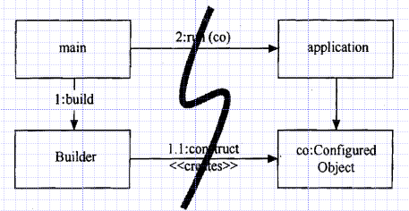
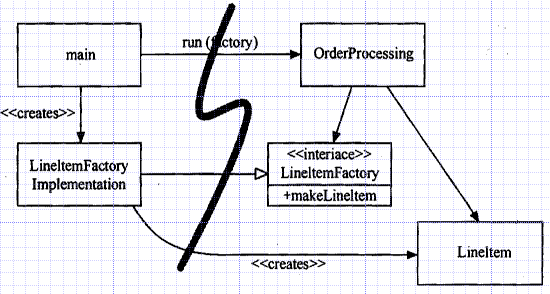

# 클린 코드  
## 목차  

* [2장 의미있는 이름](#2장-의미있는-이름)
* [3장 함수](#3장-함수)  
* [4장 주석](#4장-주석)
* [5장 형식 맞추기](#5장-형식-맞추기)
* [6장 객체와 자료구조](#6장-객체와-자료구조)
* [7장 오류 처리](#7장-오류-처리)  
* [8장 경계](#8장-경계)
* [9장 단위 테스트](#9장-단위-테스트)
* [10장 클래스](#10장-클래스)
* [11장 시스템](#11장-시스템)

## 2장 의미있는 이름  
##### 의도를 분명하게 밝혀라  
```
int daySinceCreation;
int elapsedTimeInDay;
int fileAgeInday;
```  

`str1, str2` 대신 `source, destination`을 쓰면 가독성 up

##### 검색하기 쉬운 이름을 써라  
- 통상적으로 이름이 길어질수록 검색하기 쉽다.

##### 인코딩을 피하라  
- 헝가리안 표기법처럼 타입을 변수명에 넣을 필요가 없다.
- 멤버 변수 접두어 넣을 필요 없다. `m_name`
- 인터페이스와 구현 클래스는 `IShapeFactory` 처럼 인터페이스에 표시해주기 보다는 구현 클래스에 `ShapeFactoryImpl` 이라고 나타내는게 낫다.


##### 클래스나 객체 이름  
- 클래스나 객체 이름은 명사나 명사구
- Manager, Processor, Data, Info 등과 같은 단어는 피한다.
##### 메서드 이름  
- 메서드 이름은 동사나 동사구
- set, get, is는 javabean 표준에 따라서 붙인다.
- 생성자를 중복정의 할 때는 정적 팩토리 메서드 이용
```
Complex fulcrumPoint = Complex.FromRealNumber(23.0);
Complex fulcrumPoint = new Complex(23.0);
```
아래 코드보다 위 코드가 좋다.

##### 일관성있는 어휘 사용  
- fetch, retrieve, get을 섞어쓰면? 복잡하지

##### 말장난을 하지 마라  
- add는 둘을 더하는거고, A에 B를 넣는것은 insert나 append라는 이름을 쓰자.

## 3장 함수  
##### 작게 만들어라!  
- if/else/while 등에 들어가는 블록은 한 줄이여야 한다.

##### 함수 당 추상화 수준은 하나로  
- 같은 함수 내에서 추상화 수준이 뒤죽박죽 섞이면 파악하는데 헷갈림

##### Switch case?  
- switch 문은 추상 팩토리 클래스를 구현해서 그 안에 숨긴다.

##### flag 인수는 추하다?  
- 메서드 안에서 이것저것 많이 한다고 공표하는 셈이라 추하다?

##### 부수 효과를 일으키지 마라?  
- 함수에서 한 가지를 하겠다고 명시했는데 그 안에 다른 처리도 끼어들어가 있는 것.

##### 출력 인수  
- 일반적으로 출력 인수는 피해야 한다. 함수에서 상태를 변경해야 한다면 함수가 속한 객체 상태를 변경하는 방식을 택한다.  
```
appendFooter(s);
public void appendFooter(StringBuffer report);
```
위 코드만 보고 s가 무엇인지 위해서 함수 선언부를 찾아보게 된다.
그러므로 아래 코드처럼 바꾸는게 좋다.  
```
report.appendFooter();
```

##### trycatch  
- try/catch 블록은 별도 함수로 뽑아내는 편이 좋다.
- 정상 동작과 오류처리 동작을 분리한다.


## 4장 주석  
##### 주석은 나쁜 코드를 보완하지 못한다.  
- 그 시간에 코드를 다시 고치는게 낫다.

##### 좋은 주석  
- 코드에 표현할 수 없는 부분만 쓰는게 낫다.
- 또는 결과를 경고하거나 중요성을 강조하는데 쓰인다.
- 법적인 내용을 담고 있는 주석.

##### 나쁜 주석  
- 같은 이야기를 반복하거나 주석이 또 다른 의문을 들게한다.
- 오해할 여지를 남긴다.

## 5장 형식 맞추기  
##### 수직 거리  
- 서로 밀접한 개념은 세로로 가까이 둬야한다.
- 서로 멀리 떨어져있으면 소스를 위아래로 뒤지게 되니까.

##### 변수 선언  
- 변수는 사용하는 위치에 최대한 가까이 선언한다.
- 인스턴스 변수는 클래스 맨 처음에 선언한다. 변수 간 세로로 거리를 두지 않는다.

##### 함수 선언  
- 한 함수가 다른 함수를 호출한다면 두 함수는 세로로 가까이 배치한다.
- 되도록 호출하는 함수를 호출되는 함수보다 먼저 배치한다.

## 6장 객체와 자료구조  
##### 자료 추상화  
- 변수에 대한 단순한 get,set은 구현을 노출시킬 뿐이다.(직교 좌표계, 극 좌표계)
- 추상 인터페이스를 제공해 사용자가 구현을 모른 채 자료의 핵심을 조작할 수 있어야 진정한 의미의 클래스이다.
##### 자료/객체 비대칭  
- 객체는 추상화 뒤로 자료를 숨긴 채 자료를 다루는 함수만 제공.
- 자료구조는 자료를 그대로 공개하며 별다른 함수는 제공하지 않음.
- 객체와 자료구조는 근본적으로 양분된다.
- 절차적인 코드는 새로운 자료 구조를 추가하기 어렵다. 모든 함수를 고쳐야 한다.
- 객체 지향 코드는 새로운 함수를 추가하기 어렵다. 그러려면 모든 클래스를 고쳐야 한다.
##### 디미터 법칙  
- 모듈은 자신이 조작하는 객체의 속사정을 몰라야 한다는 법칙.
- 클래스 C의 메서드 f는 다음과 같은 객체의 메서드만 호출해야 한다, 고 주장한다.
- 클래스 C
- f가 생성한 객체
- f 인수로 넘어온 객체
- C 인스턴스 변수에 저장된 객체
- 낮선 사람은 경계하고 친구랑만 놀라는 의미
```
final String outputDir = ctxt.getOptions().getScratchDir().getAbsolutePath();
```
같은 코드를 쓰지 말라는 것. 이를 기차 충돌(train wreck) 이라고 부른다.  
다음과 같이 코드를 나누는 편이 좋다.  
```
Options opts = ctxt.getOptions();
File scratchDir = opts.getScratchDir();
final String outputDir = scratchDir.getAbsolutePath();
```

## 7장 오류 처리  
##### 오류 코드보다 예외를 사용하라  
- 오류가 발생하면 예외를 던지는 편이 호출자 코드가 깔끔해진다.

##### 호출자를 고려해 예외 클래스를 작성하라  
- 오류 분류를 잘만 해놓아도 깔끔하게 예외 처리가 가능
- wrapper 클래스를 이용해서 관련 예외를 하나로 처리
```
//wrapper 클래스
LocalPort port = new LocalPort(12);
try {
  port.open();
} catch {
  //blah...
}
```

##### null을 반환하지 마라  
- null을 반환하는 것은 일거리를 늘릴 뿐 아니라 호출자에게 문제를 떠넘긴다.
- null을 반환하면 꼭 null 체크를 해줘야한다.
- 예외를 던지거나 특수 사례 개체 ex)`return Collections.emptyList()`를 반환하는 것이 좋다.

##### null을 전달하지 마라  
- null인 가능성이 있는 객체를 전달하기 이전에 null 체크가 필요하다.

## 8장 경계  
소프트웨어를 개발할 때 모든 기능을 직접 개발하는 경우는 드물다. 내가 만든 코드와 다른 팀에서 만든 코드를 통합할 때 경계를 깔끔하게 통합하는 방법에 대해서 말한다.  
##### 학습테스트  
우리 쪽 코드를 작성해 외부 코드를 호출하는 대신 먼저 간단한 테스트 케이스를 작성해 외부 코드를 익히는 것을 **학습 테스트** 라고 부른다.  

##### 분리  
- 경계에 위치하는 코든느 깔끔히 분리한다.
- 기대치를 정의하는 테스트 케이스도 작성한다.
- 외부 패키지를 호출하는 코드를 가능한 줄여 경계를 관리하자.
- 새로운 클래스로 경계를 감싸거나 아니면 Adapter 패턴을 사용해 우리가 원하는 인터페이스를 패키지가 제공하는 인터페이스로 변환하자.

## 9장 단위 테스트  
##### TDD 법칙 세 가지  
1. 실패하는 단위 테스트를 작성할 때까지 실제 코드를 작성하지 않는다.
2. 컴파일은 실패하지 않으면서 실행이 실패하는 정도로만 단위 테스트를 작성한다.
3. 현재 실패하는 테스트를 통과할 정도로만 실제 코드를 작성한다.

위 세 가지 규칙을 따르면 개발과 테스트가 대략 30초 주기로 묶인다.  

##### 깨끗한 테스트 코드 유지하기  
- 테스트 코드 또한 가독성이 높고 유지 보수성이 높아야한다.

##### F.I.R.S.T  
깨끗한 테스트는 다음 다섯 가지 규칙을 따른다.  
1. Fast : 테스트는 빨라야 한다.
2. Independent : 각 테스트는 서로 의존하면 안 된다.
3. Repeatable : 테스트는 어떤 환경에서도 반복 가능해야 한다. 실제 환경, QA 환경, 버스를 타고 집에 가는 길에 사용하는 노트북 환경에서도 마찬가지다.
4. Self-Validating : 테스트는 bool 값으로 결과를 내야 한다. 성공 아니면 실패다. 통과 여부를 알려고 로그 파일을 읽게 만들어서는 안 된다.
5. Timely : 테스트는 적시에 작성해야 한다. 단위 테스트는 테스트하려는 실제 코드를 구현하기 직전에 구현한다.

## 10장 클래스  

##### 클래스 체계  
- 정적 공개 상수 > 정적 비공개 변수 > 비공개 인스턴스 변수
- 변수 목록 다음에는 공개 함수
- 비공개 함수는 자신을 호출하는 공개 함수 직후에 넣는다.
- 그래서 프로그램은 신문 기사처럼 읽힌다.

##### 클래스는 작아야 한다!  
- 클래스는 작아야한다.
- 클래스 설명은 if, and, or, but을 사용하지 않고 25단어 내외로 가능해야 한다.
- 단일 책임 원칙(Single Responsibility Principle)은 클래스나 모듈을 변결할 이유가 단 하나 뿐이어야 한다는 원칙이다.

##### 응집도  
- 클래스는 인스턴스 변수 수가 적어야 한다.
- 각 클래스 메서드는 클래스 인스턴스 변수를 하나 이상 사용해야 한다.
- 일반적으로 메서드가 변수를 더 많이 사용할수록 메서드와 클래스는 응집도가 더 높다.
- 모든 인스턴스 변수를 메서드마다 사용하는 클래스는 응집도가 가장 높다.
- 응집도를 유지하면 작은 클래스 여럿이 나온다.

##### 변경으로부터 격리  
- 객체지향 프로그래밍 입문에서 구체적인(concrete) 클래스와 추상(abstract) 클래스가 있다고 배웠다.
- 구체적인 클래스는 상세한 구현을 포함한다.
- 추상 클래스는 개념만 포함한다.
- 상세한 구현에 의존하는 코드는 테스트가 어렵다.

Portfolio 클래스는 외부 TokyoStockExchange API를 사용해 포트폴리오 값을 계산한다. 따라서 테스트 코드는 외부 시세 변화에 영향을 받는다. 5분 마다 값이 달라지는 API로 테스트 코드를 짜기란 쉽지 않다.  
Portfolio 클래스에서 TokyoStockExchange API를 직접 호출하는 대신 StockExchange라는 인터페이스를 생성한 후 메서드를 선언한다.

```
public interface StockExchange {
  Money currentPrice(String symbol);
}
```

```
public Portfolio {
  private StockExchange exchange;
  public Portfolio(StockExchange exchange) {
    this.exchange = exchange;
  }
}
```
다음과 같이 개선한 Portfolio 클래스는 TokyoStockExchange라는 상세한 구현 클래스가 아니라 StockExchange 인터페이스에 의존한다. StockExchange 인터페이스는 주식 기호를 받아 현재 주식 가격을 반환한다는 추상적인 개념을 표현한다. 이와 같은 추상화로 실제로 주가를 얻어오는 출처나 얻어오는 방식 등과 같은 구체적인 사실을 모두 숨긴다.

## 11장 시스템  
##### 시스템 제작과 사용을 분리  
> 소프트웨어 시스템은 (애플리케이션 객체를 제작하고 의존성을 서로 '연결'하는) 준비과정과 (준비 과정 이후에 이어지는) 런타임 로직을 분리해야 한다.  

```
public Service getService() {
  if (service == null)
    service = new MyServiceImpl(...);
  return service;
}
```
위와 같은 구현 방식을 초기화 지연, 또는 계산 지연이라고 한다. 실제로 필요할 때까지 객체를 생성하지 않으므로 불필요한 부하가 걸리지 않는다. 또한 null 포인터를 반환하지 않는다.  
하지만, getService 메서드가 MyServiceImpl의 생성자 매개변수가 맞지 않으면 MyServiceImpl을 사용하지 않아도 컴파일부터 되지 않는다.  
또한, MyServiceImpl이 무거운 객체라면 단위 테스트를 할 때 적절한 테스트 전용 객체를 service 필드에 할당해야 한다. 그리고 일반 런타임 로직에 객체 생성 로직을 섞어놓은 탓에 모든 실행 경로(service가 null or not null)도 테스트해야 한다.

##### Main 분리  
- 시스템 생성과 시스템 사용을 분리하는 한 가지 방법으로, 생성과 관련되 코드는 모두 main이나 main이 호출하는 모듈로 옮기고, 나머지 시스템은 모든 객체가 생성되었고 모든 의존성이 연결되었다고 가정한ㄴ다.  
- main 함수에서 시스템에 필요한 객체를 생성한 후 이를 애플리케이션에 넘긴다. 애플리케이션은 그저 객체를 사용할 뿐이다.



##### 팩토리  
- 때로는 객체가 생성되는 시점을 애플리케이션이 결정할 필요도 생긴다.
- 예를 들어, 주문처리 시스템에서 애플리케이션은 LineItem 인스턴스를 생성해서 Order에 추가할 때 ABSTRACT FACTORY 패턴을 사용한다.
- LineItem을 생성하는 시점은 애플리케이션이 결정하지만 LineItem을 생성하는 코드는 애플리케이션이 모른다.


