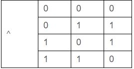
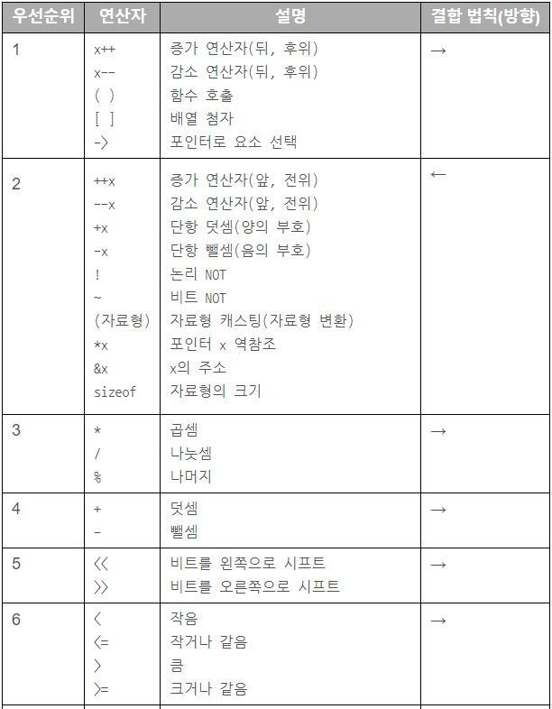
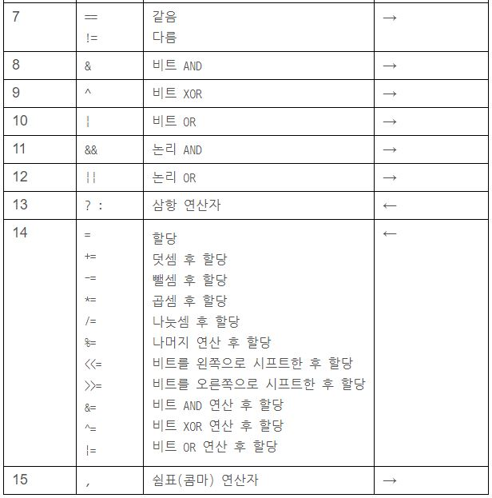

# C언어 기초문법

### 식별자(이름)  
- 영문 대소문자, 숫자, 언더스코어만 사용 가능
- 키워드 사용 불가
- 숫자로 시작될 수 없으며, 반드시 영문자나 언더스코어로 시작
- **대소문자 구분**

### 특수식별자  
- __ func__ (현재 함수의 이름)
```
printf("%s\n", __func__);
```

### 비트연산자  
```
#include <stdio.h>

int main()
{
    unsigned char num1 = 1;  // 0000 0001
    unsigned char num2 = 3;  // 0000 0011

    printf("%d\n", num1 & num2);  // 0000 0001: 01과 11을 비트 AND하면 01이 됨
    printf("%d\n", num1 | num2);  // 0000 0011: 01과 11을 비트 OR하면 11이 됨
    printf("%d\n", num1 ^ num2);  // 0000 0010: 01과 11을 비트 XOR하면 10이 됨

    return 0;
}
```
XOR
  

```  
#include <stdio.h>

int main()
{
    unsigned char num1 = 3;     //  3: 0000 0011
    unsigned char num2 = 24;    // 24: 0001 1000

    printf("%u\n", num1 << 3);  // 24: 0001 1000: num1의 비트 값을 왼쪽으로 3번 이동
    printf("%u\n", num2 >> 2);  //  6: 0000 0110: num2의 비트 값을 오른쪽으로 2번 이동

    return 0;
}
```

### 연산자 우선순위  
  
  

### 변수의 유효범위  
1. 변수는 기본적으로 선언된 블럭과 그 하위 블럭에서 사용할 수 있다.
2. 하위 블럭에 동일한 이름으로 변수가 선언되면 하위 블럭 내에서는 하위 블럭에서 선언된 변수가 사용된다.

```
#include <stdio.h>
int main (int argc, char * argv[])
{
    int var = 10;
    printf("The value before: %d\n", var);
    {
        int var = 20;
        printf("The value in block: %d\n", var);
    }
    printf("The value after: %d\n", var);
    return 0;
}
```
java는 에러난다.

### static  
```
#include <stdio.h>
int main (int argc, char * argv[])
{
    some_subfunction();
    some_subfunction();
    return 0;
}

int some_subfunction()
{
   static int var = 0;
   var += 10;
   printf ("A variable in subfunction: %d\n", var);
   return 0;
}
```
출력 결과는 10, 20이다.  
함수 내부에서 static이 선언된 경우 그 함수 내부에서만 사용 가능
전역 변수에서 static이 선언된 경우 그 파일 내에서는 전역변수로 사용 가능하지만 다른 파일에서 참조 불가능

### extern  
- 다른 파일의 전역 변수를 사용할때 선언한다.  
- 초기화 생략하면 0으로 초기화.  
- 남발하면 유지보수가 힘들어지므로 최대한 적게 쓰는걸 권장.  
- 헤더파일에 선언해서 사용하는 방식으로 많이 쓴다.
- 헤더 파일에서 초기화 할 시, 여러 파일에서 헤더파일을 참조하면 초기화 부분이 여러번 실행되면서 에러 발생.

```  
extern_value.h
extern int ex_value; // extern 선언(초기화는 다른 파일에서 해야함)
```

```
extern_value.c
#include "extern_value.h"
int ex_value = 10; // 변수 선언 + 초기화
```

```
main.c
#include "extern_value.h"
void main()
{
  printf("%d", ex_value); // extern 변수 사용
}
```

### 문자형 데이터  
- 1바이트  
- 문자열은 char[]나 char*로 표현
- 문자열 상수는 ""를 이용한다. 끝에 `\0`이 붙어있다.
- 문자열 포인터는 읽기 전용이므로 할당 시(`str3[0] = 'A'`) 에러.
- 문자열 배열은 할당 가능(`str1[0] = 'A'`)
- char[]에 문자열 선언하려면 꼭 선언과 동시에 문자열 할당해야함.

```
#include <stdio.h>
int main (int argc, char *argv[])
{
    char str1[20] = "Hello World!";
    char str2[]   = "Hello Another World!";
    char *str3    = "Hello The Other World!";

    printf("Str1: %s\n", str1);
    printf("Str2: %s\n", str2);
    printf("Str3: %s\n", str3);

    return 0;
}
```
str1은 20바이트 할당  
str2는 컴파일러가 문자 개수 세서 할당하기 때문에 21바이트 (`\0`포함)  
str3는 포인터 타입이므로 문자열 길이와 상관없이 포인터 타입 만큼 공간을 할당하고, (스태틱 영역에 있는) 문자열의 주소를 값으로 할당받는다.

### 문자열 함수  
- `strlen(char* or char[])` : 배열 길이에 상관없이 실제 문자열 길이
- `strcmp(s1, s2)` : 앞에가 크면 1, 뒤에가 크면 -1, 같으면 0
- `strcpy(dest, source)` : dest에 source내용 복붙(dest 크기 작으면 에러)
- `strcat(s1, s2)` : s1 뒤에 s2 붙이기
- `strchr(s1, 'a')` : s1에 'a' 포함되어있으면 'a'로 시작하는 포인터 반환
- `strstr(s1, s2)` : s1안에 s2 포함되어있으면 s2로 시작하는 포인터 반환

### 포인터  
- 여러개 선언시 `int *a, *b, *c;` 처럼 일일이 `*` 붙여줘야함.
- 포인터의 크기는 시스템이 32바이트에서는 4바이트, 64바이트에서는 8바이트이다.

- void 포인터  
```
// 포인터 자료형이 달라도 컴파일 경고가 발생하지 않음
ptr = numPtr1;    // void 포인터에 int 포인터 저장
ptr = cPtr1;      // void 포인터에 char 포인터 저장

// 역참조는 불가
printf("%d", *ptr);   // void 포인터는 역참조할 수 없음. 컴파일 에러
// 변수 선언 불가
void v1;    // void로는 변수를 선언할 수 없음. 컴파일 에러
```

### 이중포인터  
```
int main()
{
    int *numPtr1;     // 단일 포인터 선언
    int **numPtr2;    // 이중 포인터 선언
    int num1 = 10;

    numPtr1 = &num1;    // num1의 메모리 주소 저장

    numPtr2 = &numPtr1; // numPtr1의 메모리 주소 저장

    printf("%d\n", **numPtr2);    // 20: 포인터를 두 번 역참조하여 num1의 메모리 주소에 접근

    return 0;
}
```

### 배열  
- 선언은 `int arr[size];` 처럼 선언  
- 초기화 `int numArr[10] = { 0, };`
- `int numArr[10] = { -1, };` 로하면 0번만 -1, 나머지는 0
- 크기 `sizeof(arr) / sizeof(자료형)`

### 2차원 배열  
- 초기화 `int numArr[3][4] = { 0, };`
- 또는 `{ {}, {}, {} };`


- 포인터 할당
`int (*intPtr)[가로크기]`
```
int numArr[3][4] = {    // 세로 3, 가로 4 크기의 int형 2차원 배열 선언
       { 11, 22, 33, 44 },
       { 55, 66, 77, 88 },
       { 99, 110, 121, 132 }
   };

int (*numPtr)[4] = numArr;
```

### 포인터 + 배열  
```
int main()
{
    int numArr[10] = { 11, 22, 33, 44, 55, 66, 77, 88, 99, 110 };    // 크기가 10인 int형 배열

    int *numPtr = numArr;       // 포인터에 int형 배열을 할당

    printf("%d\n", *numPtr);    // 11: 배열)의 주소가 들어있는 포인터를 역참조하면 배열의
                                // 첫 번째 요소에 접근

    printf("%d\n", *numArr);    // 11: 배열 자체를 역참조해도 배열의 첫 번째 요소에 접근

    printf("%d\n", numPtr[5]);  // 66: 배열의 주소가 들어있는 포인터는 인덱스로 접근할 수 있음

    printf("%d\n", sizeof(numArr));    // 40: sizeof로 배열의 크기를 구하면 배열이 메모리에
                                       // 차지하는 공간이 출력됨

    printf("%d\n", sizeof(numPtr));    // 4 : sizeof로 배열의 주소가 들어있는 포인터의 크기를
                                       // 구하면 포인터의 크기가 출력됨(64비트라면 8)

    return 0;
}
```

```
int main()
{
    int Array[5]={44,77,64,13,42};
    int *p=&Array[2];

    printf("p가 가리키는 배열의 위치: %d\n", *p);
    printf("p가 가리키는 배열의 위치에서 한칸 앞: %d\n", *(p+1));
    printf("p가 가리키는 배열의 위치에서 두칸 앞: %d\n", *(p+2));
    printf("p가 가리키는 배열의 위치에서 한칸 뒤: %d\n", *(p-1));
    printf("p가 가리키는 배열의 위치에서 두칸 뒤: %d\n", *(p-2));
    return 0;
}
```

### 메모리  
- 할당  
```
int *numPtr2 = malloc(sizeof(int));
```
- 해제  
```
free(numPtr2);
```
- 특정값 설정  
```
long long *numPtr = malloc(sizeof(long long));  // long long의 크기 8바이트만큼 동적 메모리 할당

memset(numPtr, 0x27, 8);    // numPtr이 가리키는 메모리를 8바이트만큼 0x27로 설정

printf("0x%llx\n", *numPtr);    // 0x2727272727272727: 27이 8개 들어가 있음
```
- 배열  
```
int numArr[10];                           // int형 요소 10개를 가진 배열 생성
int *numPtr = malloc(sizeof(int) * 10);   // int 10개 크기만큼 메모리 할당

numArr[0] = 10;    // 배열을 인덱스로 접근하여 값 할당
numPtr[0] = 10;    // 포인터를 인덱스로 접근하여 값 할당

free(numPtr);   // 메모리 해제
```
- 2차원 배열
```
int **m = malloc(sizeof(int *) * 3);   // 이중 포인터에 (int 포인터 크기 * 세로 크기)만큼
                                           // 동적 메모리 할당. 배열의 세로

for (int i = 0; i < 3; i++)            // 세로 크기만큼 반복
{
  m[i] = malloc(sizeof(int) * 4);    // (int 크기 * 가로 크기)만큼 동적 메모리 할당.
                                     // 배열의 가로
}
```

### 구조체  
```
typedef struct _Person {    // 구조체 이름은 _Person
    char name[20];             // 구조체 멤버 1
    int age;                   // 구조체 멤버 2
    char address[100];         // 구조체 멤버 3
} Person;                   // typedef를 사용하여 구조체 별칭을 Person으로 정의
```

```
typedef struct {    // 구조체 이름이 없는 익명 구조체
    char name[20];        // 구조체 멤버 1
    int age;              // 구조체 멤버 2
    char address[100];    // 구조체 멤버 3
} Person;           // typedef를 사용하여 구조체 별칭을 Person으로 정의
```
위 모든 경우 다음과 같이 Person이라는 구조체 별칭으로 사용 가능
```
Person *p1 = malloc(sizeof(Person));    // 구조체 별칭으로 포인터 선언, 메모리 할당
```


- `typedef` 키워드와 함께쓰면 `struct` 키워드를 매번 쓰지 않아도 된다.
```  
typedef struct Man {
  char name[50];
  int  age;
  char gender;
  char tel[50];
} Man;

Man *getMan();
```

- 구조체의 포인터  
```
int main()
{
    struct Person *p1 = malloc(sizeof(struct Person));    // 구조체 포인터 선언, 메모리 할당

    // 화살표 연산자로 구조체 멤버에 접근하여 값 할당
    strcpy(p1->name, "홍길동");
    p1->age = 30;
    strcpy(p1->address, "서울시 용산구 한남동");

    // 화살표 연산자로 구조체 멤버에 접근하여 값 출력
    printf("이름: %s\n", p1->name);       // 홍길동
    printf("나이: %d\n", p1->age);        // 30
    printf("주소: %s\n", p1->address);    // 서울시 용산구 한남동

    free(p1);    // 동적 메모리 해제

    return 0;
}
```
포인터의 표현 방법은 ->와 .이 있다.

-> : 화살표 앞의 변수가 포인터 변수이면 화살표를 사용한다. 위의 예에서 처럼 ()을 사용하면 .을 사용한다.
. : 점 앞의 변수가 포인터가 아닐때 사용한다.

```
int main()
{
    int num1 = 10;
    struct Data d1;    // 구조체 변수
    struct Data *d2 = malloc(sizeof(struct Data));    // 구조체 포인터에 메모리 할당

    d1.numPtr = &num1;
    d2->numPtr = &num1;

    printf("%d\n", *d1.numPtr);     // 10: 구조체의 멤버를 역참조
    printf("%d\n", *d2->numPtr);    // 10: 구조체 포인터의 멤버를 역참조

    d2->c1 = 'a';
    printf("%c\n", (*d2).c1);      //  a: 구조체 포인터를 역참조하여 c1에 접근
                                   // d2->c1과 같음
    printf("%d\n", *(*d2).numPtr); // 10: 구조체 포인터를 역참조하여 numPtr에 접근한 뒤 다시 역참조
                                   // *d2->numPtr과 같음

    free(d2);

    return 0;
}
```

구조체 선언과 동시에 초기화
```
struct Phone {
    int areacode;
    unsigned long long number;
};

struct Person {
    char name[20];
    int age;
    struct Phone phone;
};

struct Person p1 = { .name = "Andrew", .age = 25, { .areacode = 82, .number = 3045671234 } };

```

### 구조체 함수  
- `memset(&p1, 0, sizeof(struct Point2D));` // p1을 구조체 크기만큼 0으로 설정
- `memcpy(&p2, &p1, sizeof(struct Point2D));` // Point2D 구조체 크기만큼 p1의 내용을 p2로 복사

### 열거형  
- 초기값부터 1씩 증가
- 초기값 설정하지 않으면 0부터 시작
- typedef 사용가능

```
typedef enum 열거형이름 {
    값1 = 초깃값,
    값2,
    값3
} 열거형별칭;

enum 열거형이름 {
    자료형 멤버이름;
} 변수;
```

```
typedef enum {
	mon = 1,
	tue,
	wed = 1,
	thu,
	fry = 1
}Seven;
```
1, 2, 1, 2, 1로 값이 들어간다.
