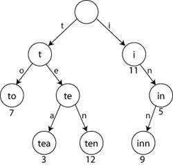

# Trie 자료구조  

- **Trie(트라이)를 이용해야 하는 이유**
우리가 여러 개의 문자열을 가지고 있을 때, 어떤 문자열이 그 문자열 중 하나인지 알아내는 방법은 뭐가 있을까?
단순하게 일일이 비교해보면 된다. 하지만 컴퓨터는 이러한 방법이 매우 비효율적이다. 예를 들어, 최대 길이가 mm인 문자열 nn개의 집합에서 마찬가지로 최대 길이가 mm인 임의의 문자열이 그 문자열들의 집합에 포함되는지를 일일이 확인하면 사전처리는 필요 없지만, 최악의 경우 O(nm)의 비교 횟수가 필요하다.  
이 문자열을 정렬시킨 뒤, 이진 탐색이라는 강력한 알고리즘을 사용하면 O(mlogn)로 단축시킬 수 있지만, 정렬 과정 자체에 O(nmlogn)의 시간이 걸리므로 사양이 안 좋은 컴퓨터라면 이것도 비효율적이다. 하지만 위의 시간 복잡도를 압도하는 알고리즘이 존재한다. 프레드킨이 이름 붙인 "Trie"라는 자료구조가 지금부터 설명할 가장 효율적인 문자열 검색법이다.  
- **구조**  
기본적으로 K진 트리의 구조를 띠고 있다. 영어사전을 생각해보면 간단하다. 우리가 'cancel'이라는 단어를 찾으려면 우선 앞 글자 'c'의 색인을 찾을 것이다. 그 다음 'a', 'n', ... 순서대로 찾아가는 것이다. 이것을 논리적으로 컴퓨터에 적용한 구조가 바로 트라이 구조이다. 이를테면 'tea'라는 문자열이 입력되었다면 순서대로 머릿글자 't'가 등록되고 그 다음 'e'가, 그 다음 'a'가 등록된다. 마지막에 문자열을 모두 찾았다면 그 위치에 "이곳에 문자열이 있소!" 하고 표시하면 되는 것이다. 그리고 그런 시작 문자열을 접두어(prefix)라고 부른다.  
  
이러한 트라이 구조는 찾고자 하는 문자열을 공간을 많이 사용하는 대신, 그 문자열의 길이의 속도만큼 초고속 탐색이 가능하다.

- **시간복잡도**  
문자열 집합의 개수와 상관 없이 찾고자 하는 문자열의 길이가 시간 복잡도가 된다. 즉, 문자열의 길이가 m이라면 시간 복잡도는 O(m). 그 이유는 간단하다. 트라이를 구현할 때, n과 m이 상대적으로 작다면 배열을 사용할 텐데, 현재 노드의 위치를 i, j번째 문자라고 한다면 trie[i][j]의 위치를 조회하는 건 O(1)에 수행이 가능하다. 여기서 m번을 수행하니 O(m)의 시간이 걸리는 것이다. 하지만 n과 m이 큰 경우에는, 메모리 확보를 위해 시간을 희생해서라도 n이 진짜 무식하게 큰 게 아닌 이상 의미없다. Map으로 트라이를 만들기도 한다. 이 경우엔 O(mlogn)의 시간이 소모된다.  

**출처 : https://namu.wiki/w/%ED%8A%B8%EB%9D%BC%EC%9D%B4#fn-4 [나무위키-trie]**
