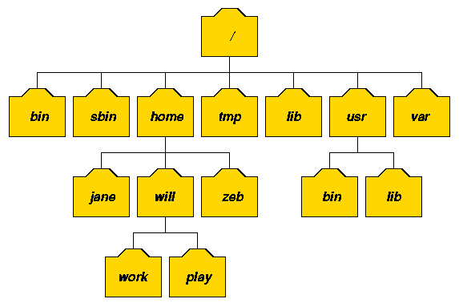

# 리눅스 디렉토리 구조  
  

**/**  
최상의 디렉토리인 루트 디렉토리를 의미하며, 리눅스의 모든 디렉토리들의 시작점이다. 즉, 모든 디렉토리들을 절대경로로 표기할 때에 이 디렉토리로부터 시작해야 한다.(/root 와 다르다)  

**/root**
시스템 최고관리자인 root 사용자의 개인 홈디렉토리.  

**/bin**  
기본적인 명령어가 저장된 디렉토리. 즉, 리눅스 시스템사용에 있어 가장 기본적이라고 할 수 있는 mv, cp, rm 등과 같은 명령어들이 이 디렉토리에 존재하며 root 사용자와 일반사용자가 함께 사용할 수 있는 명령어 디렉토리이다.  

**/sbin**
ifconfig, e2fsck, ethtool, halt 등과 같이 주로 시스템 관리자들이 사용하는 시스템관리자용 명령어를 저장하고 있는 디렉토리.  

**/boot**  
부트 로더가 존재하는 디렉토리(grub.conf)  

**/home**  
사용자의 홈디렉토리, useradd 명령어로 새로운 사용자를 생성하면 대부분 사용자의 ID와 동일한 이름의 디렉토리가 자동으로 생성됨.  

**/tmp**
일명 "공용디렉토리" . 시스템을 사용하는 모든 사용자들이 공동으로 사용하는 디렉토리. mysql 에서 사용하는 mysql.sock 등과 같은 소켓파일, 또는 아파치에서 사용하는 세션파일등이 생성되기도 한다. 웹해킹에 사용되기도 해서 주의를 요망.  

**/lib**  
커널모듈과 관련된 관련된 각종 라이브러리 파일들이 존재하는 디렉토리. (윈도우의 system32 와 비슷)  

**/usr**  
시스템이 아닌 각종 응용프로그램들이 설치되는 디렉토리. (윈도우의 Program Files 과 비슷)  
즉, c++, chsh, cpp, crontab, du, find등과 같이 일반사용자들용 명령어들은 /usr/bin 에 위치한다.  

**/usr/bin/**  
일반 사용자들이 사용가능한 명령어 파일들이 존재하는 디렉토리.  

**/usr/X11R6/**  
X 윈도우 시스템의 루트 디렉토리.  

**/usr/include/**  
C 프로그램에 필요한 헤드파일(\*.h) 디렉토리.  

**/usr/lib/**  
/lib 에 들어가지 않은 라이브러리 디렉토리.  

**/usr/sbin/**   
/bin 에 제외된 명령어와 네트워크관련 명령어가 들어있는 디렉토리.  

**/usr/src/**  
프로그램 소스(주로 커널소스)가 저장되는 디렉토리.  

**/usr/local/**  
MySQL, Apache, PHP 등과 같은 어플리케이션들을 소스로 컨파일설치할 때 사용되는 장소.  

**/usr/share/man/**  
명령어들의 도움말을 주는 메뉴얼(manual)페이지 디렉토리. 즉, 이 디렉토리에는 시스템에서 사용하는 모든 맨페이지파일(man page)이 존재함.  

**/var**  
시스템 실행시 생성되었다가 삭제되는 가변적 데이터를 저장하기 위한 디렉토리.  

**/var/tmp/**  
/tmp 디렉토리와 같은 공용디렉토리. 즉, /tmp 디렉토리와 /var/tmp 디렉토리의 퍼미션은 1777 로서 sticky bit 가 설정되어 있는 공용디렉토리이다. 리눅스 시스템에서 공용디렉토리는 /tmp 와 /var/tmp 둘뿐이다.  

**/var/log/**  
시스템로그파일(messages, secure, xferlog 파일등)이 저장되는 디렉토리.  

**/var/ftp/**  
vsftp 등과 같은 FTP 서비스를 위한 다운로드될 파일들 즉, FTP 홈디렉토리.  

**/var/named/**  
BIND 즉, DNS 에서 사용하는 zone 파일들이 저장되는 디렉토리.  

**/var/spool/mail/**  
각 계정사용자들의 메일파일이 저장되는 디렉토리.  

**/dev**  
시스템의 각종 디바이스장치 파일들을 저장하고 있는 디렉토리. (/dev/sda, /dev/dsp, /dev/psaux 등등)  

**/mnt**  
CD-ROM, USB 등 외장형 미디어를 마운트할 때 사용되는 디렉토리.  

**/media**
DVD, CD-ROM, USB 등과 같은 탈부착이 가능한 장치들의 마운트포인트로 사용되는 디렉토리.  

**/proc**
일명 "가상파일시스템" 이라고 하는 곳으로 현재 메모리에 존재하는 모든 작업들이 파일형태로 존재하는 곳이다. 디스크상에 실제 존재하는 것이 아니라 메모리상에 존재하기 때문에 가상파일시스템이라고 부른다. 실제 운용상태를 정확하게 파악할 수 있는 중요한 정보를 제공하며 여기에 존재하는 파일들 가운데 현재 실행중인 커널(kernel)의 옵션 값을 즉시 변경할 수 있는 파라미터파일들이 있기 때문에 시스템 운용에 있어 매우 중요한 의미를 가진다.

**/etc**  
시스템의 거의 모든 설정파일이 존재하는 디렉토리. /etc/sysconfig(시스템 제어판용 설정파일), /etc/passwd(사용자관리 설정파일), /etc/named.conf(DNS 설정파일) 등과 같은 파일들이 존재한다.

**/etc/ssh/**  
SSH 서비스, 즉 sshd 데몬에서 사용하는 각종 설정파일들이 존재하는 디렉토리.  

**/etc/rc.d/**  
부팅레벨별 부팅스크립트파일들이 존재하는 디렉토리.  

**/etc/rc.d/init.d/**  
시스템 초기화 파일들의 실제파일들이 존재함.  

**/etc/init.d/**  
데몬 프로그램이 위치하는 디렉토리.

**/etc/pam.d/**  
PAM 설정 정보파일들이 저장된 디렉토리.  

**/etc/httpd/**  
RPM 으로 설치된 아파치 설정파일(httpd.conf 등)들이 저장된 디렉토리.  

<참고>  
**swap**  
스왑파일시스템은 하드디스크 공간의 일부분을 메모리로 사용하는 가상메모리이다.
물리적인 메모리(RAM)가 부족할 경우 안정성을 위해 하드디스크에 가상메모리를 할당해 준것이다.  

※ 파티션을 사용자가 직접 설정하지 않고 자동으로 설치할 경우 기본적인(/, /boot, swap) 파티션을 제외한 다른 파티션들은 최상위 디렉토리인 / 밑에 단순히 디렉토리로 만들어진다.  

출처 : http://sinabro.textcube.com/74  
출처 : http://webdir.tistory.com/101
